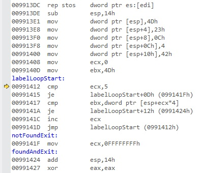

---
---


1 : We have the below program,  

```
#include "stdafx.h"
int _tmain(int argc, _TCHAR* argv[])
{
    __asm
	{
	    sub esp, 20
	}
    return 0;
}
```

Register values are the following,

EAX = CCCCCCCC EBX = 7EFDE000 ECX = 00000000 EDX = 00000001 ESI = 00000000 EDI = 0022FB2C EIP = 003F13DE ESP = 0022FA60 EBP = 0022FB2C EFL = 00000204

Relevant memory is the following,

0x0022FA3C 772e041d  
0x0022FA40 0003a27a  
0x0022FA44 fffffffe  
0x0022FA48 772a36fa  
0x0022FA4C 772a32f2  
0x0022FA50 00428358  
0x0022FA54 00428360  
0x0022FA58 00000000  
0x0022FA5C 00000000  
0x0022FA60 00000000  
0x0022FA64 00000000  
0x0022FA68 7efde000  
0x0022FA6C cccccccc  
0x0022FA70 cccccccc  
0x0022FA74 cccccccc  

Disassembly is the following,   


What will be the value of ESP after the execution of the instruction sub esp, 20 in the above program?  

a) 0022FA60  
b) 0022FA5C  
c) 0022FA58  
d) 0022FA4C  

**Answer** d)  

**Descrption**

Sub esp, 20 means we are allocating 5 locations of stack memory 4 bytes each. So the value of ESP will be 0022FA4C which is evident from the stack memory locations given.  

---
---


2 : We have the below program,  

```
#include "stdafx.h"
int _tmain(int argc, _TCHAR* argv[])
{
    __asm
	{
	    sub esp, 20
	}
    return 0;
}
```

Register values are the following,

EAX = CCCCCCCC EBX = 7EFDE000 ECX = 00000000 EDX = 00000001 ESI = 00000000 EDI = 0022FB2C EIP = 003F13DE ESP = 0022FA60 EBP = 0022FB2C EFL = 00000204

Relevant memory is the following,

0x0022FA3C 772e041d  
0x0022FA40 0003a27a  
0x0022FA44 fffffffe  
0x0022FA48 772a36fa  
0x0022FA4C 772a32f2  
0x0022FA50 00428358  
0x0022FA54 00428360  
0x0022FA58 00000000  
0x0022FA5C 00000000  
0x0022FA60 00000000  
0x0022FA64 00000000  
0x0022FA68 7efde000  
0x0022FA6C cccccccc   
0x0022FA70 cccccccc  
0x0022FA74 cccccccc  

Disassembly is the following,  


What will be the value of EIP after the execution of the instruction sub esp, 20?  

a) 003F13DE  
b) 003F13E1  
c) 003F13E8  
d) 003F13F0  

**Answer** b)  

**Descrption**

EIP will always point to the next instruction whose EIP here is 003F13E1 which is evident from the disassembly.    

---
---


3 : We have the below program,  

```
#include "stdafx.h"
int _tmain(int argc, _TCHAR* argv[])
{
    __asm
	{
	    mov dword ptr[esp], 77
	}
    return 0;
}
```

Register values are the following,

EAX = CCCCCCCC EBX = 7EFDE000 ECX = 00000000 EDX = 00000001 ESI = 00000000 EDI = 0022FB2C EIP = 003F13DE ESP = 0022FA4C EBP = 0022FB2C EFL = 00000204

Relevant memory is the following,

0x0022FA3C 772e041d  
0x0022FA40 0003a27a  
0x0022FA44 fffffffe  
0x0022FA48 772a36fa  
0x0022FA4C 772a32f2  
0x0022FA50 00428358  
0x0022FA54 00428360  
0x0022FA58 00000000  
0x0022FA5C 00000000  
0x0022FA60 00000000  
0x0022FA64 00000000  
0x0022FA68 7efde000  
0x0022FA6C cccccccc  
0x0022FA70 cccccccc  
0x0022FA74 cccccccc  

Disassembly is the following,  

  

What will be the value of the memory location 0022FA4C, after the execution of the instruction mov dword ptr[esp], 77?  

a) 772a32f2  
b) 0000004D (Hex value of 77)  
c) 00000000  
d) 0022FA4C  

**Answer** b)  

**Descrption**

mov dword ptr[esp], 77 instruction will move the value 77 (Hex value is 4D) to the memory location [esp] that is 0022FA4C.  

---
---


4 : We have the below program,  

```
#include "stdafx.h"
int _tmain(int argc, _TCHAR* argv[])
{
    __asm
	{
	    mov dword ptr[esp], 77
	}
    return 0;
}
```

Register values are the following,

EAX = CCCCCCCC EBX = 7EFDE000 ECX = 00000000 EDX = 00000001 ESI = 00000000 EDI = 0022FB2C EIP = 003F13DE ESP = 0022FA4C EBP = 0022FB2C EFL = 00000204

Relevant memory is the following,

0x0022FA3C 772e041d  
0x0022FA40 0003a27a  
0x0022FA44 fffffffe  
0x0022FA48 772a36fa  
0x0022FA4C 772a32f2  
0x0022FA50 00428358  
0x0022FA54 00428360  
0x0022FA58 00000000  
0x0022FA5C 00000000  
0x0022FA60 00000000  
0x0022FA64 00000000  
0x0022FA68 7efde000  
0x0022FA6C cccccccc  
0x0022FA70 cccccccc  
0x0022FA74 cccccccc  

Disassembly is the following,  


What will be the value of EIP after the execution of the instruction mov dword ptr[esp], 77? (Hex value is 4D)   

a) 003F13E1  
b) 003F13E8  
c) 003F13F0  
d) 003F13F8  

**Answer** b)  

**Descrption**

EIP will always point to the next instruction whose EIP here is 003F13E8, which is evident from the disassembly.  

---
---


5 : We have the below program,  

```
#include "stdafx.h"
int _tmain(int argc, _TCHAR* argv[])
{
    __asm
	{
	    mov dword ptr[esp + 4], 35
	}
    return 0;
}
```

Register values are the following,

EAX = CCCCCCCC EBX = 7EFDE000 ECX = 00000000 EDX = 00000001 ESI = 00000000 EDI = 0022FB2C EIP = 003F13DE ESP = 0022FA4C EBP = 0022FB2C EFL = 00000204

Relevant memory is the following,

0x0022FA3C 772e041d  
0x0022FA40 0003a27a  
0x0022FA44 fffffffe  
0x0022FA48 772a36fa  
0x0022FA4C 772a32f2  
0x0022FA50 00428358  
0x0022FA54 00428360  
0x0022FA58 00000000  
0x0022FA5C 00000000  
0x0022FA60 00000000  
0x0022FA64 00000000  
0x0022FA68 7efde000  
0x0022FA6C cccccccc  
0x0022FA70 cccccccc  
0x0022FA74 cccccccc  

Disassembly is the following,  


Value of which memory location will become 23 (Hex value of 35) after the execution of the instruction mov dword ptr[esp + 4], 35?  

a) 0022FA50  
b) 0022FA54  
c) 0022FA58  
d) 0022FA5C  

**Answer** a)  

**Descrption**

[esp + 4] is the next memory location after [esp], which is 0022FA50 and it is understood from the relevant memory locations shown. It will become 23 (hex value of 35).   

---
---


6 : We have the below program,  

```
#include "stdafx.h"
int _tmain(int argc, _TCHAR* argv[])
{
    __asm
	{
	    mov dword ptr[esp + 4], 35
	}
    return 0;
}
```

Register values are the following,

EAX = CCCCCCCC EBX = 7EFDE000 ECX = 00000000 EDX = 00000001 ESI = 00000000 EDI = 0022FB2C EIP = 003F13DE ESP = 0022FA4C EBP = 0022FB2C EFL = 00000204

Relevant memory is the following,

0x0022FA3C 772e041d  
0x0022FA40 0003a27a  
0x0022FA44 fffffffe  
0x0022FA48 772a36fa  
0x0022FA4C 772a32f2  
0x0022FA50 00428358  
0x0022FA54 00428360  
0x0022FA58 00000000  
0x0022FA5C 00000000  
0x0022FA60 00000000  
0x0022FA64 00000000  
0x0022FA68 7efde000  
0x0022FA6C cccccccc  
0x0022FA70 cccccccc  
0x0022FA74 cccccccc  

Disassembly is the following,  


What will be the value of EIP after the execution of the instruction mov dword ptr[esp + 4], 35? (Hex value of 35 is 23)  

a) 003F13E1  
b) 003F13E8  
c) 003F13F0  
d) 003F13F8  

**Answer** c)  

**Descrption**

EIP will always point to the next instruction whose EIP here is 003F13F0, which is evident from the disassembly.  

---
---


7 : We have the below program,  

```
#include "stdafx.h"
int _tmain(int argc, _TCHAR* argv[])
{
    __asm
	{
	    mov dword ptr[esp + 8], 12
	}
    return 0;
}
```

Register values are the following,

EAX = CCCCCCCC EBX = 7EFDE000 ECX = 00000000 EDX = 00000001 ESI = 00000000 EDI = 0022FB2C EIP = 003F13DE ESP = 0022FA4C EBP = 0022FB2C EFL = 00000204

Relevant memory is the following,

0x0022FA3C 772e041d   
0x0022FA40 0003a27a  
0x0022FA44 fffffffe  
0x0022FA48 772a36fa  
0x0022FA4C 772a32f2  
0x0022FA50 00428358  
0x0022FA54 00428360  
0x0022FA58 00000000  
0x0022FA5C 00000000  
0x0022FA60 00000000  
0x0022FA64 00000000  
0x0022FA68 7efde000  
0x0022FA6C cccccccc  
0x0022FA70 cccccccc  
0x0022FA74 cccccccc  

Disassembly is the following,  


What will be the value of the memory location 0022FA54, after the execution of the instruction mov dword ptr[esp + 8], 12?  

a) 772a32f2  
b) 0000004D (Hex value of 77)  
c) 0000000C (Hex value of 12)  
d) 0022FA4C  

**Answer** c)  

**Descrption**

mov dword ptr[esp + 8], 12 instruction will move the value 12 (Hex value is 0C) to the memory location [esp + 8] that is 0022FA54.  

---
---


8 : We have the below program,  

```
#include "stdafx.h"
int _tmain(int argc, _TCHAR* argv[])
{
    __asm
	{
	    mov dword ptr[esp + 8], 12
	}
    return 0;
}
```

Register values are the following,

EAX = CCCCCCCC EBX = 7EFDE000 ECX = 00000000 EDX = 00000001 ESI = 00000000 EDI = 0022FB2C EIP = 003F13DE ESP = 0022FA4C EBP = 0022FB2C EFL = 00000204

Relevant memory is the following,

0x0022FA3C 772e041d   
0x0022FA40 0003a27a  
0x0022FA44 fffffffe  
0x0022FA48 772a36fa  
0x0022FA4C 772a32f2  
0x0022FA50 00428358  
0x0022FA54 00428360  
0x0022FA58 00000000  
0x0022FA5C 00000000  
0x0022FA60 00000000  
0x0022FA64 00000000  
0x0022FA68 7efde000  
0x0022FA6C cccccccc  
0x0022FA70 cccccccc  
0x0022FA74 cccccccc  

Disassembly is the following,  


What will be the value of EIP after the execution of the instruction mov dword ptr[esp + 8], 12? (Hex value of 12 is 0C)  

a) 003F13E1  
b) 003F13E8  
c) 003F13F0  
d) 003F13F8  

**Answer** d)  

**Descrption**

EIP will always point to the next instruction whose EIP here is 003F13F8, which is evident from the disassembly.    

---
---


9 : We have the below program,  

```
#include "stdafx.h"
int _tmain(int argc, _TCHAR* argv[])
{
    __asm
	{
	    mov dword ptr[esp + 0Ch], 4
	}
    return 0;
}
```

Register values are the following,

EAX = CCCCCCCC EBX = 7EFDE000 ECX = 00000000 EDX = 00000001 ESI = 00000000 EDI = 0022FB2C EIP = 003F13DE ESP = 0022FA4C EBP = 0022FB2C EFL = 00000204

Relevant memory is the following,

0x0022FA3C 772e041d  
0x0022FA40 0003a27a  
0x0022FA44 fffffffe  
0x0022FA48 772a36fa  
0x0022FA4C 772a32f2  
0x0022FA50 00428358  
0x0022FA54 00428360  
0x0022FA58 00000000  
0x0022FA5C 00000000  
0x0022FA60 00000000  
0x0022FA64 00000000  
0x0022FA68 7efde000  
0x0022FA6C cccccccc  
0x0022FA70 cccccccc  
0x0022FA74 cccccccc  

Disassembly is the following,  


Value of which memory location will become 4, after the execution of the instruction mov dword ptr[esp + 0Ch], 4?  

a) 0022FA50  
b) 0022FA54  
c) 0022FA58  
d) 0022FA5C  

**Answer** c)  

**Descrption**

[esp + 0Ch] is the third memory location after [esp], which is 0022FA58 and it is understood from the relevant memory location shown.  

---
---


10 : We have the below program,  

```
#include "stdafx.h"
int _tmain(int argc, _TCHAR* argv[])
{
    __asm
	{
	    mov dword ptr[esp + 0Ch], 4
	}
    return 0;
}
```

Register values are the following,

EAX = CCCCCCCC EBX = 7EFDE000 ECX = 00000000 EDX = 00000001 ESI = 00000000 EDI = 0022FB2C EIP = 003F13DE ESP = 0022FA4C EBP = 0022FB2C EFL = 00000204

Relevant memory is the following,

0x0022FA3C 772e041d  
0x0022FA40 0003a27a  
0x0022FA44 fffffffe  
0x0022FA48 772a36fa  
0x0022FA4C 772a32f2  
0x0022FA50 00428358  
0x0022FA54 00428360  
0x0022FA58 00000000  
0x0022FA5C 00000000  
0x0022FA60 00000000   
0x0022FA64 00000000  
0x0022FA68 7efde000  
0x0022FA6C cccccccc  
0x0022FA70 cccccccc  
0x0022FA74 cccccccc  

Disassembly is the following,  


What will be the value of EIP after the execution of the instruction mov dword ptr[esp + 0Ch], 4?  

a) 003F13E1  
b) 003F1400  
c) 003F13F0  
d) 003F13F8  

**Answer** b)  

**Descrption**

EIP will always point to the next instruction whose EIP here is 003F1400, which is evident from the disassembly.  

---
---


11 : We have the below program,  

```
#include "stdafx.h"
int _tmain(int argc, _TCHAR* argv[])
{
    __asm
	{
	    mov dword ptr[esp + 10h], 66
	}
    return 0;
}
```

Register values are the following,

EAX = CCCCCCCC EBX = 7EFDE000 ECX = 00000000 EDX = 00000001 ESI = 00000000 EDI = 0022FB2C EIP = 003F13DE ESP = 0022FA4C EBP = 0022FB2C EFL = 00000204

Relevant memory is the following,

0x0022FA3C 772e041d  
0x0022FA40 0003a27a  
0x0022FA44 fffffffe  
0x0022FA48 772a36fa  
0x0022FA4C 772a32f2  
0x0022FA50 00428358  
0x0022FA54 00428360  
0x0022FA58 00000000  
0x0022FA5C 00000000  
0x0022FA60 00000000  
0x0022FA64 00000000  
0x0022FA68 7efde000  
0x0022FA6C cccccccc  
0x0022FA70 cccccccc  
0x0022FA74 cccccccc  

Disassembly is the following,  


What will be the value of the memory location 0022FA5C, after the execution of the instruction mov dword ptr[esp + 10h], 66?  

a)00000042 (Hex value of 66)  
b) 0000004D (Hex value of 77)  
c) 0000000C (Hex value of 12)  
d) 0022FA4C  

**Answer** a)  

**Descrption**

mov dword ptr[esp + 10h], 66 instruction will move the value 66 (Hex value is 42) to the memory location [esp + 10h] that is 0022FA5C.  

---
---


12 : We have the below program,  

```
#include "stdafx.h"
int _tmain(int argc, _TCHAR* argv[])
{
    __asm
	{
	    mov dword ptr[esp + 10h], 66
	}
    return 0;
}
```

Register values are the following,

EAX = CCCCCCCC EBX = 7EFDE000 ECX = 00000000 EDX = 00000001 ESI = 00000000 EDI = 0022FB2C EIP = 003F13DE ESP = 0022FA4C EBP = 0022FB2C EFL = 00000204

Relevant memory is the following,

0x0022FA3C 772e041d  
0x0022FA40 0003a27a  
0x0022FA44 fffffffe  
0x0022FA48 772a36fa  
0x0022FA4C 772a32f2  
0x0022FA50 00428358  
0x0022FA54 00428360  
0x0022FA58 00000000  
0x0022FA5C 00000000  
0x0022FA60 00000000  
0x0022FA64 00000000  
0x0022FA68 7efde000  
0x0022FA6C cccccccc  
0x0022FA70 cccccccc  
0x0022FA74 cccccccc   

Disassembly is the following,  


What will be the value of EIP after the execution of the instruction mov dword ptr[esp + 10h], 66? (Hex value is 42)  

a) 003F13E1  
b) 003F13E8  
c) 003F1408  
d) 003F1400  

**Answer** c)  

**Descrption**

EIP will always point to the next instruction whose EIP here is 003F1408, which is evident from the disassembly.    

---
---


13 : We have the below program,  

```
#include "stdafx.h"
int _tmain(int argc, _TCHAR* argv[])
{
    __asm
	{
	    mov ecx, 0
	    mov ebx, 77
	}
    return 0;
}
```

Register values are the following,

EAX = CCCCCCCC EBX = 7EFDE000 ECX = 00000000 EDX = 00000001 ESI = 00000000 EDI = 002CFD70 EIP = 00991408 ESP = 002CFC90 EBP = 002CFD70 EFL = 00000206

Relevant memory is the following,

0x002CFC8C 777c36fa  
0x002CFC90 0000004d  
0x002CFC94 00000023  
0x002CFC98 0000000c  
0x002CFC9C 00000004  
0x002CFCA0 00000042  
0x002CFCA4 00000000  
0x002CFCA8 00000000  
0x002CFCAC 7efde000  
0x002CFCB0 cccccccc  
0x002CFCB4 cccccccc  

Disassembly is the following,  


What will be the value of ECX after the execution of the instruction mov ecx, 0?  

a) 00000000  
b) CCCCCCCC  
c) 00000077  
d) 00000001  

**Answer** a)  

**Descrption**

Here we are moving a value 0 to ECX register, so it will become 00000000.  

---
---


14 : We have the below program,  

```
#include "stdafx.h"
int _tmain(int argc, _TCHAR* argv[])
{
    __asm
	{
	    mov ecx, 0
	    mov ebx, 77
	}
    return 0;
}
```

Register values are the following,

EAX = CCCCCCCC EBX = 7EFDE000 ECX = 00000000 EDX = 00000001 ESI = 00000000 EDI = 002CFD70 EIP = 00991408 ESP = 002CFC90 EBP = 002CFD70 EFL = 00000206

Relevant memory is the following,

0x002CFC8C 777c36fa  
0x002CFC90 0000004d  
0x002CFC94 00000023  
0x002CFC98 0000000c  
0x002CFC9C 00000004  
0x002CFCA0 00000042  
0x002CFCA4 00000000  
0x002CFCA8 00000000  
0x002CFCAC 7efde000  
0x002CFCB0 cccccccc  
0x002CFCB4 cccccccc  

Disassembly is the following,  


What will be the value of EIP after the execution of the instruction mov ecx, 0?  

a) 00991408  
b) 0099140D  
c) 00991412  
d) 00991415  

**Answer** b)  

**Descrption**

EIP will always point to the next instruction whose EIP here is 0099140D, which is evident from the disassembly.  

---
---


15 : We have the below program,  

```
#include "stdafx.h"
int _tmain(int argc, _TCHAR* argv[])
{
    __asm
	{
	    mov ecx, 0
	    mov ebx, 77
	}
    return 0;
}
```

Register values are the following,

EAX = CCCCCCCC EBX = 7EFDE000 ECX = 00000000 EDX = 00000001 ESI = 00000000 EDI = 002CFD70 EIP = 00991408 ESP = 002CFC90 EBP = 002CFD70 EFL = 00000206

Relevant memory is the following,

0x002CFC8C 777c36fa  
0x002CFC90 0000004d  
0x002CFC94 00000023  
0x002CFC98 0000000c  
0x002CFC9C 00000004  
0x002CFCA0 00000042  
0x002CFCA4 00000000  
0x002CFCA8 00000000  
0x002CFCAC 7efde000  
0x002CFCB0 cccccccc  
0x002CFCB4 cccccccc  

Disassembly is the following,  


What will be the value of EBX after the execution of the instruction mov ebx, 77?  

a) 7EFDE000  
b) 00000000  
c) 00000001  
d) 0000004D (Hex value of 77)  

**Answer** d)  

**Descrption**

Here we are moving a value 77 (Hex value is 4D) to EBX register, so it will become 0000004D.  

---
---


16 : We have the below program,  

```
#include "stdafx.h"
int _tmain(int argc, _TCHAR* argv[])
{
    __asm
	{
	    mov ecx, 0
	    mov ebx, 77
	}
    return 0;
}
```

Register values are the following,

EAX = CCCCCCCC EBX = 7EFDE000 ECX = 00000000 EDX = 00000001 ESI = 00000000 EDI = 002CFD70 EIP = 00991408 ESP = 002CFC90 EBP = 002CFD70 EFL = 00000206

Relevant memory is the following,

0x002CFC8C 777c36fa  
0x002CFC90 0000004d  
0x002CFC94 00000023  
0x002CFC98 0000000c  
0x002CFC9C 00000004  
0x002CFCA0 00000042  
0x002CFCA4 00000000  
0x002CFCA8 00000000  
0x002CFCAC 7efde000  
0x002CFCB0 cccccccc  
0x002CFCB4 cccccccc  

Disassembly is the following,  


What will be the value of EIP after the execution of the instruction mov ebx, 77?  

a) 00991408  
b) 0099140D  
c) 00991412  
d) 00991415  

**Answer** c)  

**Descrption**

EIP will always point to the next instruction whose EIP here is 00991412, which is evident from the disassembly.  

---
---


17 : We have the below program,  

```
#include "stdafx.h"
int _tmain(int argc, _TCHAR* argv[])
{
    __asm
	{
        labelLoopStart:
	    cmp ecx, 5
	    jz notFoundExit

        notFoundExit :
	    mov ecx, -1
	}
    return 0;
}
```

Register values are the following,

EAX = CCCCCCCC EBX = 0000004D ECX = 00000000 EDX = 00000001 ESI = 00000000 EDI = 002CFD70 EIP = 00991412 ESP = 002CFC90 EBP = 002CFD70 EFL = 00000206

Relevant memory is the following,

0x002CFC8C 777c36fa  
0x002CFC90 0000004d  
0x002CFC94 00000023  
0x002CFC98 0000000c  
0x002CFC9C 00000004  
0x002CFCA0 00000042  
0x002CFCA4 00000000  
0x002CFCA8 00000000  
0x002CFCAC 7efde000  
0x002CFCB0 cccccccc  
0x002CFCB4 cccccccc  

Disassembly is the following,  


What will be the value of EIP after the execution of the instruction cmp ecx, 5?  

a) 00991412  
b) 00991415   
c) 00991417  
d) 0099141F  

**Answer** b)  

**Descrption**

EIP will always point to the next instruction whose EIP here is 00991415, which is evident from the disassembly. Je is same as jz, as jump on zero means that both values are equal, that is je.  

---
---


18 : We have the below program,  

```
#include "stdafx.h"
int _tmain(int argc, _TCHAR* argv[])
{
    __asm
	{
        labelLoopStart:
	    cmp ecx, 5
	    jz notFoundExit

        notFoundExit :
	    mov ecx, -1
	}
    return 0;
}
```

Register values are the following,

EAX = CCCCCCCC EBX = 0000004D ECX = 00000000 EDX = 00000001 ESI = 00000000 EDI = 002CFD70 EIP = 00991412 ESP = 002CFC90 EBP = 002CFD70 EFL = 00000206

Relevant memory is the following,

0x002CFC8C 777c36fa  
0x002CFC90 0000004d  
0x002CFC94 00000023  
0x002CFC98 0000000c  
0x002CFC9C 00000004  
0x002CFCA0 00000042  
0x002CFCA4 00000000  
0x002CFCA8 00000000  
0x002CFCAC 7efde000  
0x002CFCB0 cccccccc  
0x002CFCB4 cccccccc  

Disassembly is the following,  



What will be the value of EIP, after the execution of the instruction, jz notFoundExit, if the value of ECX is 0?  

a) 00991412  
b) 00991415  
c) 00991417  
d) 0099141F  

**Answer** c)  

**Descrption**

After the execution of the instruction, jz notFoundExit, EIP will be pointing to next instruction whose EIP is 00991417. It will not jump to notFoundExit, as when ECX is 0, jump on zero (jz) will not succeed as 0 – 5 is not equal to 0. Je is same as jz, as jump on zero means that both values are equal, that is je.  

---
---


19 : We have the below program,  

```
#include "stdafx.h"
int _tmain(int argc, _TCHAR* argv[])
{
    __asm
	{
        labelLoopStart:
	    cmp ecx, 5
	    jz notFoundExit

        notFoundExit :
	    mov ecx, -1
	}
    return 0;
}
```

Register values are the following,

EAX = CCCCCCCC EBX = 0000004D ECX = 00000000 EDX = 00000001 ESI = 00000000 EDI = 002CFD70 EIP = 00991412 ESP = 002CFC90 EBP = 002CFD70 EFL = 00000206

Relevant memory is the following,

0x002CFC8C 777c36fa  
0x002CFC90 0000004d  
0x002CFC94 00000023  
0x002CFC98 0000000c  
0x002CFC9C 00000004  
0x002CFCA0 00000042  
0x002CFCA4 00000000  
0x002CFCA8 00000000  
0x002CFCAC 7efde000  
0x002CFCB0 cccccccc  
0x002CFCB4 cccccccc  

Disassembly is the following,  


What will be the value of EIP, after the execution of the instruction, jz notFoundExit, if the value of ECX is 1?
  
