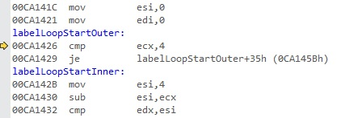
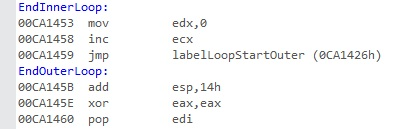
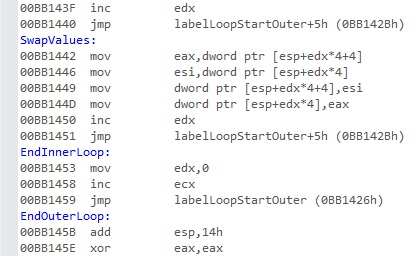
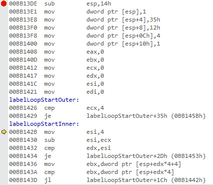

---
---


1 : We have the below program,  

```
#include "stdafx.h"
int _tmain(int argc, _TCHAR* argv[])
{
    __asm
	{
	    sub esp, 20
	}
    return 0;
}
```

Register values are the following,

EAX = CCCCCCCC EBX = 01055000 ECX = 00000000 EDX = 00000001 ESI = 00FD1078 EDI = 0133FB24 EIP = 00FD13DE ESP = 0133FA58 EBP = 0133FB24 EFL = 00000200

Relevant memory is the following,

0x0133FA38 00fd1078  
0x0133FA3C 01055000  
0x0133FA40 01560000  
0x0133FA44 015695d0  
0x0133FA48 f2b63fe4  
0x0133FA4C 01560000  
0x0133FA50 0133fa30  
0x0133FA54 0133fa74  
0x0133FA58 00fd1078  
0x0133FA5C 00fd1078  
0x0133FA60 01055000  

Disassembly is the following,  


What will be the value of ESP after the execution of the instruction sub esp, 20 in the above program?   

a) 0133FA58  
b) 0133FA54  
c) 0133FA48  
d) 0133FA44  

**Answer** d)

**Description** 

Sub esp, 20 means we are allocating 5 locations of stack memory 4 bytes each. So the value of ESP will be 0133FA44, which is evident from the stack memory locations given.  

---
---


2 : We have the below program,  

```
#include "stdafx.h"
int _tmain(int argc, _TCHAR* argv[])
{
    __asm
	{
	    sub esp, 20
	}
    return 0;
}
```

Register values are the following,

EAX = CCCCCCCC EBX = 01055000 ECX = 00000000 EDX = 00000001 ESI = 00FD1078 EDI = 0133FB24 EIP = 00FD13DE ESP = 0133FA58 EBP = 0133FB24 EFL = 00000200

Relevant memory is the following,

0x0133FA38 00fd1078  
0x0133FA3C 01055000  
0x0133FA40 01560000  
0x0133FA44 015695d0  
0x0133FA48 f2b63fe4  
0x0133FA4C 01560000  
0x0133FA50 0133fa30  
0x0133FA54 0133fa74  
0x0133FA58 00fd1078  
0x0133FA5C 00fd1078  
0x0133FA60 01055000  

Disassembly is the following,  


What will be the value of EIP after the execution of the instruction sub esp, 20 in the above program?  

a) 00FD13DE  
b) 00FD13E1  
c) 00FD13E8  
d) 00FD13F0  

**Answer** d)

**Description**

EIP will always point to next instruction which here is 00FD13E1 and it is evident from the disassembly shown.  

---
---


3 : We have the below program,  

```
#include "stdafx.h"
int _tmain(int argc, _TCHAR* argv[])
{
    __asm
	{
	    mov dword ptr[esp], 0x1
	}
    return 0;
}
```

Register values are the following,

EAX = CCCCCCCC EBX = 01055000 ECX = 00000000 EDX = 00000001 ESI = 00FD1078 EDI = 0133FB24 EIP = 00FD13E1 ESP = 0133FA44 EBP = 0133FB24 EFL = 00000200

Relevant memory is the following,

0x0133FA38 00fd1078  
0x0133FA3C 01055000  
0x0133FA40 01560000  
0x0133FA44 015695d0  
0x0133FA48 f2b63fe4  
0x0133FA4C 01560000  
0x0133FA50 0133fa30  
0x0133FA54 0133fa74  
0x0133FA58 00fd1078  
0x0133FA5C 00fd1078  
0x0133FA60 01055000  

Disassembly is the following,  


What will be the value of the memory location 0133FA44, after the execution of the instruction mov dword ptr[esp], 0x1?  

a) 00000001  
b) 0133FA44  
c) 00000035  
d) 00FD13E1  

**Answer** a)

**Description**

mov dword ptr[esp], 0x1 instruction will move the value 1 to the memory location [esp] that is 0133FA44.  

---
---


4 : We have the below program,  

```
#include "stdafx.h"
int _tmain(int argc, _TCHAR* argv[])
{
    __asm
	{
	    mov dword ptr[esp], 0x1
	}
    return 0;
}
```

Register values are the following,

EAX = CCCCCCCC EBX = 01055000 ECX = 00000000 EDX = 00000001 ESI = 00FD1078 EDI = 0133FB24 EIP = 00FD13E1 ESP = 0133FA44 EBP = 0133FB24 EFL = 00000200

Relevant memory is the following,

0x0133FA38 00fd1078  
0x0133FA3C 01055000  
0x0133FA40 01560000  
0x0133FA44 015695d0  
0x0133FA48 f2b63fe4  
0x0133FA4C 01560000  
0x0133FA50 0133fa30  
0x0133FA54 0133fa74  
0x0133FA58 00fd1078  
0x0133FA5C 00fd1078  
0x0133FA60 01055000  

Disassembly is the following,  


What will be the value of EIP after the execution of the instruction mov dword ptr[esp], 0x1?  

a) 00FD13DE  
b) 00FD13E1  
c) 00FD13E8  
d) 00FD13F0  

**Answer** c)

**Description**

EIP will always point to next instruction which here is 00FD13E8 and it is evident from the disassembly shown.  

---
---


5 : We have the below program,  

```
#include "stdafx.h"
int _tmain(int argc, _TCHAR* argv[])
{
    __asm
	{
	    mov dword ptr[esp + 4], 0x35
	}
    return 0;
}
```

Register values are the following,

EAX = CCCCCCCC EBX = 01055000 ECX = 00000000 EDX = 00000001 ESI = 00FD1078 EDI = 0133FB24 EIP = 00FD13E1 ESP = 0133FA44 EBP = 0133FB24 EFL = 00000200

Relevant memory is the following,

0x0133FA38 00fd1078  
0x0133FA3C 01055000  
0x0133FA40 01560000  
0x0133FA44 015695d0  
0x0133FA48 f2b63fe4  
0x0133FA4C 01560000  
0x0133FA50 0133fa30  
0x0133FA54 0133fa74  
0x0133FA58 00fd1078  
0x0133FA5C 00fd1078  
0x0133FA60 01055000  

Disassembly is the following,  


Value of which memory location will become 35 after the execution of the instruction mov dword ptr[esp + 4], 0x35?  

a) 0133FA44  
b) 0133FA48  
c) 0133FA4C  
d) 0133FA50  

**Answer** b)

**Description**

[esp + 4] is the next memory location after [esp], which is 0133FA48 and it is understood from the relevant memory locations shown and it will become 0x35.   

---
---


6 : We have the below program,  

```
#include "stdafx.h"
int _tmain(int argc, _TCHAR* argv[])
{
    __asm
	{
	    mov dword ptr[esp + 4], 0x35
	}
    return 0;
}
```

Register values are the following,

EAX = CCCCCCCC EBX = 01055000 ECX = 00000000 EDX = 00000001 ESI = 00FD1078 EDI = 0133FB24 EIP = 00FD13E1 ESP = 0133FA44 EBP = 0133FB24 EFL = 00000200

Relevant memory is the following,

0x0133FA38 00fd1078  
0x0133FA3C 01055000  
0x0133FA40 01560000  
0x0133FA44 015695d0  
0x0133FA48 f2b63fe4  
0x0133FA4C 01560000  
0x0133FA50 0133fa30  
0x0133FA54 0133fa74  
0x0133FA58 00fd1078  
0x0133FA5C 00fd1078  
0x0133FA60 01055000  

Disassembly is the following,  


What will be the value of EIP after the execution of the instruction mov dword ptr[esp + 4], 0x35?  

a) 00FD13DE  
b) 00FD13E1  
c) 00FD13E8  
d) 00FD13F0  

**Answer** d)

**Description**

EIP will always point to next instruction which here is 00FD13F0 and it is evident from the disassembly shown.  

---
---


7 : We have the below program,  

```
#include "stdafx.h"
int _tmain(int argc, _TCHAR* argv[])
{
    __asm
	{
	    mov dword ptr[esp + 8], 0x12
	}
    return 0;
}
```

Register values are the following,

EAX = CCCCCCCC EBX = 01055000 ECX = 00000000 EDX = 00000001 ESI = 00FD1078 EDI = 0133FB24 EIP = 00FD13E1 ESP = 0133FA44 EBP = 0133FB24 EFL = 00000200

Relevant memory is the following,

0x0133FA38 00fd1078  
0x0133FA3C 01055000  
0x0133FA40 01560000   
0x0133FA44 015695d0  
0x0133FA48 f2b63fe4  
0x0133FA4C 01560000  
0x0133FA50 0133fa30  
0x0133FA54 0133fa74  
0x0133FA58 00fd1078  
0x0133FA5C 00fd1078  
0x0133FA60 01055000  

Disassembly is the following,  


What will be the value of the memory location 0133FA4C, after the execution of the instruction mov dword ptr[esp + 8], 0x12?   

a) 00000001  
b) 00000035  
c) 00000012  
d) 0133FA50  

**Answer** c)

**Description**

mov dword ptr[esp + 8], 0x12 instruction will move the value 0x12 to the memory location [esp + 8] that is 0133FA4C.  

---
---


8 : We have the below program,  

```
#include "stdafx.h"
int _tmain(int argc, _TCHAR* argv[])
{
    __asm
	{
	    mov dword ptr[esp + 8], 0x12
	}
    return 0;
}
```

Register values are the following,

EAX = CCCCCCCC EBX = 01055000 ECX = 00000000 EDX = 00000001 ESI = 00FD1078 EDI = 0133FB24 EIP = 00FD13E1 ESP = 0133FA44 EBP = 0133FB24 EFL = 00000200

Relevant memory is the following,

0x0133FA38 00fd1078  
0x0133FA3C 01055000  
0x0133FA40 01560000   
0x0133FA44 015695d0  
0x0133FA48 f2b63fe4  
0x0133FA4C 01560000  
0x0133FA50 0133fa30  
0x0133FA54 0133fa74  
0x0133FA58 00fd1078  
0x0133FA5C 00fd1078  
0x0133FA60 01055000  

Disassembly is the following,  


What will be the value of EIP after the execution of the instruction mov dword ptr[esp + 8], 0x12?  

a) 00FD13DE  
b) 00FD13E1  
c) 00FD13E8  
d) 00FD13F8  

**Answer** d)

**Description**

EIP will always point to next instruction which here is 00FD13F8 and it is evident from the disassembly shown.  

---
---


9 : We have the below program,  

```
#include "stdafx.h"
int _tmain(int argc, _TCHAR* argv[])
{
    __asm
	{
	    mov dword ptr[esp + 0Ch], 0x4
	}
    return 0;
}
```

Register values are the following,

EAX = CCCCCCCC EBX = 01055000 ECX = 00000000 EDX = 00000001 ESI = 00FD1078 EDI = 0133FB24 EIP = 00FD13E1 ESP = 0133FA44 EBP = 0133FB24 EFL = 00000200

Relevant memory is the following,

0x0133FA38 00fd1078  
0x0133FA3C 01055000  
0x0133FA40 01560000  
0x0133FA44 015695d0  
0x0133FA48 f2b63fe4  
0x0133FA4C 01560000  
0x0133FA50 0133fa30  
0x0133FA54 0133fa74  
0x0133FA58 00fd1078  
0x0133FA5C 00fd1078  
0x0133FA60 01055000  

Disassembly is the following,  


Value of which memory location will become 0x4 after the execution of the instruction mov dword ptr[esp + 0Ch], 0x4?  

a) 0133FA44  
b) 0133FA48  
c) 0133FA4C  
d) 0133FA50  

**Answer** d)

**Description**

[esp + 0Ch] is the third memory location after [esp], which is 0133FA50 and it is understood from the relevant memory locations shown and it will become 0x4.   

---
---


10 : We have the below program,  

```
#include "stdafx.h"
int _tmain(int argc, _TCHAR* argv[])
{
    __asm
	{
	    mov dword ptr[esp + 0Ch], 0x4
	}
    return 0;
}
```

Register values are the following,

EAX = CCCCCCCC EBX = 01055000 ECX = 00000000 EDX = 00000001 ESI = 00FD1078 EDI = 0133FB24 EIP = 00FD13E1 ESP = 0133FA44 EBP = 0133FB24 EFL = 00000200

Relevant memory is the following,

0x0133FA38 00fd1078  
0x0133FA3C 01055000  
0x0133FA40 01560000  
0x0133FA44 015695d0  
0x0133FA48 f2b63fe4  
0x0133FA4C 01560000  
0x0133FA50 0133fa30  
0x0133FA54 0133fa74  
0x0133FA58 00fd1078  
0x0133FA5C 00fd1078  
0x0133FA60 01055000  

Disassembly is the following,  


What will be the value of EIP after the execution of the instruction mov dword ptr[esp + 0Ch], 0x4?  

a) 00FD13DE  
b) 00FD13E1  
c) 00FD13E8  
d) 00FD1400  

**Answer** d)

**Description**

EIP will always point to next instruction which here is 00FD1400 and it is evident from the disassembly shown.  

---
---


11 : We have the below program,  

```
#include "stdafx.h"
int _tmain(int argc, _TCHAR* argv[])
{
    __asm
	{
	    mov dword ptr[esp + 10h], 0x1
	}
    return 0;
}
```

Register values are the following,

EAX = CCCCCCCC EBX = 01055000 ECX = 00000000 EDX = 00000001 ESI = 00FD1078 EDI = 0133FB24 EIP = 00FD13E1 ESP = 0133FA44 EBP = 0133FB24 EFL = 00000200

Relevant memory is the following,

0x0133FA38 00fd1078  
0x0133FA3C 01055000  
0x0133FA40 01560000  
0x0133FA44 015695d0  
0x0133FA48 f2b63fe4  
0x0133FA4C 01560000  
0x0133FA50 0133fa30  
0x0133FA54 0133fa74  
0x0133FA58 00fd1078  
0x0133FA5C 00fd1078  
0x0133FA60 01055000  

Disassembly is the following,  


What will be the value of the memory location 0133FA54, after the execution of the instruction mov dword ptr[esp + 10h], 0x1?  

a) 00000001  
b) 00000035  
c) 00000012  
d) 0133FA50  

**Answer** a)

**Description**

mov dword ptr[esp + 10h], 0x1 instruction will move the value 0x1 to the memory location [esp + 10h] that is 0133FA54, which is the fourth memory location from [esp].  

---
---


12 : We have the below program,  

```
#include "stdafx.h"
int _tmain(int argc, _TCHAR* argv[])
{
    __asm
	{
	    mov dword ptr[esp + 10h], 0x1
	}
    return 0;
}
```

Register values are the following,

EAX = CCCCCCCC EBX = 01055000 ECX = 00000000 EDX = 00000001 ESI = 00FD1078 EDI = 0133FB24 EIP = 00FD13E1 ESP = 0133FA44 EBP = 0133FB24 EFL = 00000200

Relevant memory is the following,

0x0133FA38 00fd1078  
0x0133FA3C 01055000  
0x0133FA40 01560000  
0x0133FA44 015695d0  
0x0133FA48 f2b63fe4  
0x0133FA4C 01560000  
0x0133FA50 0133fa30  
0x0133FA54 0133fa74  
0x0133FA58 00fd1078  
0x0133FA5C 00fd1078  
0x0133FA60 01055000  

Disassembly is the following,  


What will be the value of EIP after the execution of the instruction mov dword ptr[esp + 10h], 0x1?  

a) 00FD13DE  
b) 00FD13E1  
c) 00FD13E8  
d) 00FD1408  

**Answer** d)

**Description**

EIP will always point to next instruction which here is 00FD1408 and it is evident from the disassembly shown.  

---
---


13 : We have the below program,  

```
#include "stdafx.h"
int _tmain(int argc, _TCHAR* argv[])
{
	__asm
	{
	labelLoopStartOuter:
	    cmp ecx, 4
	    jz EndOuterLoop

	EndOuterLoop :
	    add esp, 20
	}
	return 0;
}
```

Register values are the following,

EAX = 00000000 EBX = 00000000 ECX = 00000000 EDX = 00000000 ESI = 00000000 EDI = 00000000 EIP = 00CA1426 ESP = 010FFB9C EBP = 010FFC7C EFL = 00000214

Relevant memory is the following,

0x010FFB90 00ca1078  
0x010FFB94 00f65000  
0x010FFB98 013a0000  
0x010FFB9C 00000001  
0x010FFBA0 00000035  
0x010FFBA4 00000012  
0x010FFBA8 00000004  
0x010FFBAC 00000001  
0x010FFBB0 00ca1078  
0x010FFBB4 00ca1078  
0x010FFBB8 00f65000  

Disassembly is the following,  



What will be the value of EIP after the execution of the instruction cmp ecx, 4 in the above program?  

a) 00CA1426  
b) 00CA1429  
c) 00CA142B  
d) 00CA145B  

**Answer** b)

**Description**

EIP will always be pointing to the next instruction to execute which here is 00CA1429 and it is evident from the disassembly shown.   

---
---


14 : We have the below program,  

```
#include "stdafx.h"
int _tmain(int argc, _TCHAR* argv[])
{
	__asm
	{
	labelLoopStartOuter:
	    cmp ecx, 4
	    jz EndOuterLoop

	EndOuterLoop :
	    add esp, 20
	}
	return 0;
}
```

Register values are the following,

EAX = 00000000 EBX = 00000000 ECX = 00000000 EDX = 00000000 ESI = 00000000 EDI = 00000000 EIP = 00CA1426 ESP = 010FFB9C EBP = 010FFC7C EFL = 00000214

Relevant memory is the following,

0x010FFB90 00ca1078  
0x010FFB94 00f65000  
0x010FFB98 013a0000  
0x010FFB9C 00000001  
0x010FFBA0 00000035  
0x010FFBA4 00000012  
0x010FFBA8 00000004  
0x010FFBAC 00000001  
0x010FFBB0 00ca1078  
0x010FFBB4 00ca1078  
0x010FFBB8 00f65000  

Disassembly is the following,  


What will be the value of EIP after the execution of the instruction jz EndOuterLoop if the value of ECX is 0, in the above program?  

a) 00CA1426  
b) 00CA1429  
c) 00CA142B  
d) 00CA145B  

**Answer** c)

**Description**

After the execution of the instruction, jz EndOuterLoop, EIP will be pointing to next instruction whose EIP is 00CA142B. It will not jump to EndOuterLoop, as when ECX is 0, jump on zero (jz) will not succeed, because 0 – 4 is not equal to 0. Je is same as jz, as jump on zero means that both values are equal, that is je.  

---
---


15 : We have the below program,  

```
#include "stdafx.h"
int _tmain(int argc, _TCHAR* argv[])
{
	__asm
	{
	labelLoopStartOuter:
	    cmp ecx, 4
	    jz EndOuterLoop

	EndOuterLoop :
	    add esp, 20
	}
	return 0;
}
```

Register values are the following,

EAX = 00000000 EBX = 00000000 ECX = 00000000 EDX = 00000000 ESI = 00000000 EDI = 00000000 EIP = 00CA1426 ESP = 010FFB9C EBP = 010FFC7C EFL = 00000214

Relevant memory is the following,

0x010FFB90 00ca1078  
0x010FFB94 00f65000  
0x010FFB98 013a0000  
0x010FFB9C 00000001  
0x010FFBA0 00000035  
0x010FFBA4 00000012  
0x010FFBA8 00000004  
0x010FFBAC 00000001  
0x010FFBB0 00ca1078  
0x010FFBB4 00ca1078  
0x010FFBB8 00f65000  

Disassembly is the following,  


What will be the value of EIP after the execution of the instruction jz EndOuterLoop if the value of ECX is 1, in the above program?  

a) 00CA1426  
b) 00CA142B  
c) 00CA1429  
d) 00CA145B  

**Answer** c)

**Description**

After the execution of the instruction, jz EndOuterLoop, EIP will be pointing to next instruction whose EIP is 00CA142B. It will not jump to EndOuterLoop, as when ECX is 1, jump on zero (jz) will not succeed, because 1 – 4 is not equal to 0. Je is same as jz, as jump on zero means that both values are equal, that is je.  

---
---


16 : We have the below program,  

```
#include "stdafx.h"
int _tmain(int argc, _TCHAR* argv[])
{
	__asm
	{
	labelLoopStartOuter:
	    cmp ecx, 4
	    jz EndOuterLoop

	EndOuterLoop :
	    add esp, 20
	}
	return 0;
}
```

Register values are the following,

EAX = 00000000 EBX = 00000000 ECX = 00000000 EDX = 00000000 ESI = 00000000 EDI = 00000000 EIP = 00CA1426 ESP = 010FFB9C EBP = 010FFC7C EFL = 00000214

Relevant memory is the following,

0x010FFB90 00ca1078
0x010FFB94 00f65000
0x010FFB98 013a0000
0x010FFB9C 00000001
0x010FFBA0 00000035
0x010FFBA4 00000012
0x010FFBA8 00000004
0x010FFBAC 00000001
0x010FFBB0 00ca1078
0x010FFBB4 00ca1078
0x010FFBB8 00f65000

Disassembly is the following,  




What will be the value of EIP after the execution of the instruction jz EndOuterLoop if the value of ECX is 2, in the above program?  

a) 00CA1426  
b) 00CA1429  
c) 00CA142B  
d) 00CA145B  

**Answer** c)

**Description**

After the execution of the instruction, jz EndOuterLoop, EIP will be pointing to next instruction whose EIP is 00CA142B. It will not jump to EndOuterLoop, as when ECX is 2, jump on zero (jz) will not succeed, because 2 – 4 is not equal to 0. Je is same as jz, as jump on zero means that both values are equal, that is je.  

---
---


17 : We have the below program,  

```
#include "stdafx.h"
int _tmain(int argc, _TCHAR* argv[])
{
	__asm
	{
	labelLoopStartOuter:
	    cmp ecx, 4
	    jz EndOuterLoop

	EndOuterLoop :
	    add esp, 20
	}
	return 0;
}
```

Register values are the following,

EAX = 00000000 EBX = 00000000 ECX = 00000000 EDX = 00000000 ESI = 00000000 EDI = 00000000 EIP = 00CA1426 ESP = 010FFB9C EBP = 010FFC7C EFL = 00000214

Relevant memory is the following,

0x010FFB90 00ca1078  
0x010FFB94 00f65000  
0x010FFB98 013a0000  
0x010FFB9C 00000001  
0x010FFBA0 00000035  
0x010FFBA4 00000012  
0x010FFBA8 00000004  
0x010FFBAC 00000001  
0x010FFBB0 00ca1078  
0x010FFBB4 00ca1078  
0x010FFBB8 00f65000  

Disassembly is the following,  

  


What will be the value of EIP after the execution of the instruction jz EndOuterLoop if the value of ECX is 3, in the above program?  

a) 00CA1426  
b) 00CA142B  
c) 00CA1429  
d) 00CA145B  

**Answer** b)

**Description**

After the execution of the instruction, jz EndOuterLoop, EIP will be pointing to next instruction whose EIP is 00CA142B. It will not jump to EndOuterLoop, as when ECX is 3, jump on zero (jz) will not succeed, because 3 – 4 is not equal to 0. Je is same as jz, as jump on zero means that both values are equal, that is je.  

---
---


18 : We have the below program,  

```
#include "stdafx.h"
int _tmain(int argc, _TCHAR* argv[])
{
	__asm
	{
	labelLoopStartOuter:
	    cmp ecx, 4
	    jz EndOuterLoop

	EndOuterLoop :
	    add esp, 20
	}
	return 0;
}
```

Register values are the following,

EAX = 00000000 EBX = 00000000 ECX = 00000000 EDX = 00000000 ESI = 00000000 EDI = 00000000 EIP = 00CA1426 ESP = 010FFB9C EBP = 010FFC7C EFL = 00000214

Relevant memory is the following,

0x010FFB90 00ca1078  
0x010FFB94 00f65000  
0x010FFB98 013a0000  
0x010FFB9C 00000001  
0x010FFBA0 00000035  
0x010FFBA4 00000012  
0x010FFBA8 00000004  
0x010FFBAC 00000001  
0x010FFBB0 00ca1078  
0x010FFBB4 00ca1078  
0x010FFBB8 00f65000  

Disassembly is the following,

  


What will be the value of EIP after the execution of the instruction jz EndOuterLoop if the value of ECX is 4, in the above program?  

a) 00CA1426  
b) 00CA142B  
c) 00CA1429  
d) 00CA145B  

**Answer** d)

**Description**

After the execution of the instruction, jz EndOuterLoop, EIP will be pointing to EndOuterLoop whose EIP is 00CA145B. It will jump to EndOuterLoop, as when ECX is 4, jump on zero (jz) will succeed, because 4 – 4 is equal to 0. Je is same as jz, as jump on zero means that both values are equal, that is je.  

---
---


19 : We have the below program,  

```
#include "stdafx.h"
int _tmain(int argc, _TCHAR* argv[])
{
	__asm
	{
	    sub esp, 20

	    mov dword ptr[esp], 0x1
	    mov dword ptr[esp + 4], 0x35
	    mov dword ptr[esp + 8], 0x12
	    mov dword ptr[esp + 0Ch], 0x4
	    mov dword ptr[esp + 10h], 0x1

	    mov eax, 0
	    mov ebx, 0
	    mov ecx, 0
	    mov edx, 0
	    mov esi, 0
	    mov edi, 0


	labelLoopStartOuter:
	    cmp ecx, 4
	    jz EndOuterLoop

	labelLoopStartInner:
	    mov esi, 4
	    sub esi, ecx
	    cmp edx, esi
	    jz EndInnerLoop

	    mov ebx, dword ptr[esp + edx * 4 + 4]
	    cmp ebx, dword ptr[esp + edx * 4]
	    jl SwapValues
	    inc edx
	    jmp labelLoopStartInner

	SwapValues :
	    mov eax, dword ptr[esp + edx * 4 + 4]
	    mov esi, dword ptr[esp + edx * 4]
	    mov dword ptr[esp + edx * 4 + 4], esi
	    mov dword ptr[esp + edx * 4], eax
	    inc edx
	    jmp labelLoopStartInner
	
	EndInnerLoop :
	    mov edx, 0
	    inc ecx
	    jmp labelLoopStartOuter

        EndOuterLoop :
	    add esp, 20
	}
	return 0;
}
```

Register values are the following,

EAX = 00000000 EBX = 00000000 ECX = 00000000 EDX = 00000000 ESI = 00000004 EDI = 00000000 EIP = 00BB142B ESP = 012FF76C EBP = 012FF84C EFL = 00000295

Relevant memory is the following,

0x012FF75C 00bb1078  
0x012FF760 00bb1078  
0x012FF764 0107f000  
0x012FF768 015d0000  
0x012FF76C 00000001  
0x012FF770 00000035  
0x012FF774 00000012  
0x012FF778 00000004  
0x012FF77C 00000001  
0x012FF780 00bb1078  
0x012FF784 00bb1078  
0x012FF788 0107f000  

Disassembly is the following,  

  


What will be the value of ESI register after the execution of the instruction mov esi, 4, in the above program?  

a) 00000000  
b) 00000004  
c) 00BB142B  
d) 00BB1430  

**Answer** b)

**Description**

By the instruction mov esi, 4 we are moving a value 4 to the ESI register, so it will become 00000004.   

---
---


20 : We have the below program,  

```
#include "stdafx.h"
int _tmain(int argc, _TCHAR* argv[])
{
	__asm
	{
	    sub esp, 20

	    mov dword ptr[esp], 0x1
	    mov dword ptr[esp + 4], 0x35
	    mov dword ptr[esp + 8], 0x12
	    mov dword ptr[esp + 0Ch], 0x4
	    mov dword ptr[esp + 10h], 0x1

	    mov eax, 0
	    mov ebx, 0
	    mov ecx, 0
	    mov edx, 0
	    mov esi, 0
	    mov edi, 0


	labelLoopStartOuter:
	    cmp ecx, 4
	    jz EndOuterLoop

	labelLoopStartInner:
	    mov esi, 4
	    sub esi, ecx
	    cmp edx, esi
	    jz EndInnerLoop

	    mov ebx, dword ptr[esp + edx * 4 + 4]
	    cmp ebx, dword ptr[esp + edx * 4]
	    jl SwapValues
	    inc edx
	    jmp labelLoopStartInner

	SwapValues :
	    mov eax, dword ptr[esp + edx * 4 + 4]
	    mov esi, dword ptr[esp + edx * 4]
	    mov dword ptr[esp + edx * 4 + 4], esi
	    mov dword ptr[esp + edx * 4], eax
	    inc edx
	    jmp labelLoopStartInner
	
	EndInnerLoop :
	    mov edx, 0
	    inc ecx
	    jmp labelLoopStartOuter

        EndOuterLoop :
	    add esp, 20
	}
	return 0;
}
```

Register values are the following,

EAX = 00000000 EBX = 00000000 ECX = 00000000 EDX = 00000000 ESI = 00000004 EDI = 00000000 EIP = 00BB142B ESP = 012FF76C EBP = 012FF84C EFL = 00000295

Relevant memory is the following,

0x012FF75C 00bb1078  
0x012FF760 00bb1078  
0x012FF764 0107f000  
0x012FF768 015d0000  
0x012FF76C 00000001  
0x012FF770 00000035  
0x012FF774 00000012  
0x012FF778 00000004  
0x012FF77C 00000001  
0x012FF780 00bb1078  
0x012FF784 00bb1078  
0x012FF788 0107f000  

Disassembly is the following,  

  


What will be the value of EIP register after the execution of the instruction mov esi, 4, in the above program?  

a) 00BB142B  
b) 00BB1430  
c) 00BB1432  
d) 00BB1434  

**Answer** b)

**Description**

EIP will always be pointing to next instruction which here is 00BB1430 and it is evident from the disassembly shown.  

---
---


21 : We have the below program,  

```
#include "stdafx.h"
int _tmain(int argc, _TCHAR* argv[])
{
	__asm
	{
	    sub esp, 20

	    mov dword ptr[esp], 0x1
	    mov dword ptr[esp + 4], 0x35
	    mov dword ptr[esp + 8], 0x12
	    mov dword ptr[esp + 0Ch], 0x4
	    mov dword ptr[esp + 10h], 0x1

	    mov eax, 0
	    mov ebx, 0
	    mov ecx, 0
	    mov edx, 0
	    mov esi, 0
	    mov edi, 0


	labelLoopStartOuter:
	    cmp ecx, 4
	    jz EndOuterLoop

	labelLoopStartInner:
	    mov esi, 4
	    sub esi, ecx
	    cmp edx, esi
	    jz EndInnerLoop

	    mov ebx, dword ptr[esp + edx * 4 + 4]
	    cmp ebx, dword ptr[esp + edx * 4]
	    jl SwapValues
	    inc edx
	    jmp labelLoopStartInner

	SwapValues :
	    mov eax, dword ptr[esp + edx * 4 + 4]
	    mov esi, dword ptr[esp + edx * 4]
	    mov dword ptr[esp + edx * 4 + 4], esi
	    mov dword ptr[esp + edx * 4], eax
	    inc edx
	    jmp labelLoopStartInner
	
	EndInnerLoop :
	    mov edx, 0
	    inc ecx
	    jmp labelLoopStartOuter

        EndOuterLoop :
	    add esp, 20
	}
	return 0;
}
```

Register values are the following,

EAX = 00000000 EBX = 00000000 ECX = 00000000 EDX = 00000000 ESI = 00000004 EDI = 00000000 EIP = 00BB142B ESP = 012FF76C EBP = 012FF84C EFL = 00000295

Relevant memory is the following,

0x012FF75C 00bb1078  
0x012FF760 00bb1078  
0x012FF764 0107f000  
0x012FF768 015d0000  
0x012FF76C 00000001  
0x012FF770 00000035  
0x012FF774 00000012  
0x012FF778 00000004  
0x012FF77C 00000001  
0x012FF780 00bb1078  
0x012FF784 00bb1078  
0x012FF788 0107f000  

Disassembly is the following,  

  


What will be the value of ESI register after the execution of the instruction sub esi, ecx, in the above program if the value of ECX is 0?   

a) 00000000  
b) 00000004  
c) 00BB142B  
d) 00000003  

**Answer** b)

**Description**

If ECX is 0, sub esi, ecx will be 4 – 0 which is 4 and will be saved in the ESI register.  

---
---


22 : We have the below program,  

```
#include "stdafx.h"
int _tmain(int argc, _TCHAR* argv[])
{
	__asm
	{
	    sub esp, 20

	    mov dword ptr[esp], 0x1
	    mov dword ptr[esp + 4], 0x35
	    mov dword ptr[esp + 8], 0x12
	    mov dword ptr[esp + 0Ch], 0x4
	    mov dword ptr[esp + 10h], 0x1

	    mov eax, 0
	    mov ebx, 0
	    mov ecx, 0
	    mov edx, 0
	    mov esi, 0
	    mov edi, 0


	labelLoopStartOuter:
	    cmp ecx, 4
	    jz EndOuterLoop

	labelLoopStartInner:
	    mov esi, 4
	    sub esi, ecx
	    cmp edx, esi
	    jz EndInnerLoop

	    mov ebx, dword ptr[esp + edx * 4 + 4]
	    cmp ebx, dword ptr[esp + edx * 4]
	    jl SwapValues
	    inc edx
	    jmp labelLoopStartInner

	SwapValues :
	    mov eax, dword ptr[esp + edx * 4 + 4]
	    mov esi, dword ptr[esp + edx * 4]
	    mov dword ptr[esp + edx * 4 + 4], esi
	    mov dword ptr[esp + edx * 4], eax
	    inc edx
	    jmp labelLoopStartInner
	
	EndInnerLoop :
	    mov edx, 0
	    inc ecx
	    jmp labelLoopStartOuter

        EndOuterLoop :
	    add esp, 20
	}
	return 0;
}
```

Register values are the following,

EAX = 00000000 EBX = 00000000 ECX = 00000000 EDX = 00000000 ESI = 00000004 EDI = 00000000 EIP = 00BB142B ESP = 012FF76C EBP = 012FF84C EFL = 00000295

Relevant memory is the following,

0x012FF75C 00bb1078  
0x012FF760 00bb1078  
0x012FF764 0107f000  
0x012FF768 015d0000  
0x012FF76C 00000001  
0x012FF770 00000035  
0x012FF774 00000012  
0x012FF778 00000004  
0x012FF77C 00000001  
0x012FF780 00bb1078  
0x012FF784 00bb1078  
0x012FF788 0107f000  

Disassembly is the following,  

  


What will be the value of EIP register after the execution of the instruction sub esi, ecx, in the above program?  

a) 00BB142B  
b) 00BB1430  
c) 00BB1432  
d) 00BB1434  

**Answer** c)

**Description**

EIP will always be pointing to next instruction which here is 00BB1432 and it is evident from the disassembly shown.  

---
---


23 : We have the below program,  

```
#include "stdafx.h"
int _tmain(int argc, _TCHAR* argv[])
{
	__asm
	{
	    sub esp, 20

	    mov dword ptr[esp], 0x1
	    mov dword ptr[esp + 4], 0x35
	    mov dword ptr[esp + 8], 0x12
	    mov dword ptr[esp + 0Ch], 0x4
	    mov dword ptr[esp + 10h], 0x1

	    mov eax, 0
	    mov ebx, 0
	    mov ecx, 0
	    mov edx, 0
	    mov esi, 0
	    mov edi, 0


	labelLoopStartOuter:
	    cmp ecx, 4
	    jz EndOuterLoop

	labelLoopStartInner:
	    mov esi, 4
	    sub esi, ecx
	    cmp edx, esi
	    jz EndInnerLoop

	    mov ebx, dword ptr[esp + edx * 4 + 4]
	    cmp ebx, dword ptr[esp + edx * 4]
	    jl SwapValues
	    inc edx
	    jmp labelLoopStartInner

	SwapValues :
	    mov eax, dword ptr[esp + edx * 4 + 4]
	    mov esi, dword ptr[esp + edx * 4]
	    mov dword ptr[esp + edx * 4 + 4], esi
	    mov dword ptr[esp + edx * 4], eax
	    inc edx
	    jmp labelLoopStartInner
	
	EndInnerLoop :
	    mov edx, 0
	    inc ecx
	    jmp labelLoopStartOuter

        EndOuterLoop :
	    add esp, 20
	}
	return 0;
}
```

Register values are the following,

EAX = 00000000 EBX = 00000000 ECX = 00000000 EDX = 00000000 ESI = 00000004 EDI = 00000000 EIP = 00BB142B ESP = 012FF76C EBP = 012FF84C EFL = 00000295

Relevant memory is the following,

0x012FF75C 00bb1078  
0x012FF760 00bb1078  
0x012FF764 0107f000  
0x012FF768 015d0000  
0x012FF76C 00000001  
0x012FF770 00000035  
0x012FF774 00000012  
0x012FF778 00000004  
0x012FF77C 00000001  
0x012FF780 00bb1078  
0x012FF784 00bb1078  
0x012FF788 0107f000  

Disassembly is the following,  

  


What will be the value of EIP register after the execution of the instruction cmp edx, esi, in the above program?  

a) 00BB142B  
b) 00BB1430  
c) 00BB1432  
d) 00BB1434  

**Answer** d)

**Description**

EIP will always be pointing to next instruction which here is 00BB1434 and it is evident from the disassembly shown.  

---
---


24 : We have the below program,  

```
#include "stdafx.h"
int _tmain(int argc, _TCHAR* argv[])
{
	__asm
	{
	    sub esp, 20

	    mov dword ptr[esp], 0x1
	    mov dword ptr[esp + 4], 0x35
	    mov dword ptr[esp + 8], 0x12
	    mov dword ptr[esp + 0Ch], 0x4
	    mov dword ptr[esp + 10h], 0x1

	    mov eax, 0
	    mov ebx, 0
	    mov ecx, 0
	    mov edx, 0
	    mov esi, 0
	    mov edi, 0


	labelLoopStartOuter:
	    cmp ecx, 4
	    jz EndOuterLoop

	labelLoopStartInner:
	    mov esi, 4
	    sub esi, ecx
	    cmp edx, esi
	    jz EndInnerLoop

	    mov ebx, dword ptr[esp + edx * 4 + 4]
	    cmp ebx, dword ptr[esp + edx * 4]
	    jl SwapValues
	    inc edx
	    jmp labelLoopStartInner

	SwapValues :
	    mov eax, dword ptr[esp + edx * 4 + 4]
	    mov esi, dword ptr[esp + edx * 4]
	    mov dword ptr[esp + edx * 4 + 4], esi
	    mov dword ptr[esp + edx * 4], eax
	    inc edx
	    jmp labelLoopStartInner
	
	EndInnerLoop :
	    mov edx, 0
	    inc ecx
	    jmp labelLoopStartOuter

        EndOuterLoop :
	    add esp, 20
	}
	return 0;
}
```

Register values are the following,

EAX = 00000000 EBX = 00000000 ECX = 00000000 EDX = 00000000 ESI = 00000004 EDI = 00000000 EIP = 00BB142B ESP = 012FF76C EBP = 012FF84C EFL = 00000295

Relevant memory is the following,

0x012FF75C 00bb1078  
0x012FF760 00bb1078  
0x012FF764 0107f000  
0x012FF768 015d0000  
0x012FF76C 00000001  
0x012FF770 00000035  
0x012FF774 00000012  
0x012FF778 00000004  
0x012FF77C 00000001  
0x012FF780 00bb1078  
0x012FF784 00bb1078  
0x012FF788 0107f000   

Disassembly is the following,  

  


What will be the value of EIP register after the execution of the instruction jz EndInnerLoop, in the above program?  

a) 00BB1434  
b) 00BB1436  
c) 00BB143A  
d) 00BB1453  

**Answer** b)

**Description**

After the instruction jz EndInnerLoop, it will not jump to EndInnerLoop because the result of the previous operation is not 0. As we can see from the register values, EDX is 0 and ESI is 4, cmp edx, esi will be 0 – 4 and it is not equal to 0, so the jump will not happen. It will be pointing to the next instruction which here is 00BB1436. Je (jump equal to) is same as jz (jump on zero) because jump equal to means that both values are equal and their difference will be 0.      

---
---


25 : We have the below program,  

```
#include "stdafx.h"
int _tmain(int argc, _TCHAR* argv[])
{
	__asm
	{
	    sub esp, 20

	    mov dword ptr[esp], 0x1
	    mov dword ptr[esp + 4], 0x35
	    mov dword ptr[esp + 8], 0x12
	    mov dword ptr[esp + 0Ch], 0x4
	    mov dword ptr[esp + 10h], 0x1

	    mov eax, 0
	    mov ebx, 0
	    mov ecx, 0
	    mov edx, 0
	    mov esi, 0
	    mov edi, 0


	labelLoopStartOuter:
	    cmp ecx, 4
	    jz EndOuterLoop

	labelLoopStartInner:
	    mov esi, 4
	    sub esi, ecx
	    cmp edx, esi
	    jz EndInnerLoop

	    mov ebx, dword ptr[esp + edx * 4 + 4]
	    cmp ebx, dword ptr[esp + edx * 4]
	    jl SwapValues
	    inc edx
	    jmp labelLoopStartInner

	SwapValues :
	    mov eax, dword ptr[esp + edx * 4 + 4]
	    mov esi, dword ptr[esp + edx * 4]
	    mov dword ptr[esp + edx * 4 + 4], esi
	    mov dword ptr[esp + edx * 4], eax
	    inc edx
	    jmp labelLoopStartInner
	
	EndInnerLoop :
	    mov edx, 0
	    inc ecx
	    jmp labelLoopStartOuter

        EndOuterLoop :
	    add esp, 20
	}
	return 0;
}
```

Register values are the following,

EAX = 00000000 EBX = 00000000 ECX = 00000000 EDX = 00000000 ESI = 00000004 EDI = 00000000 EIP = 00BB142B ESP = 012FF76C EBP = 012FF84C EFL = 00000295

Relevant memory is the following,

0x012FF75C 00bb1078  
0x012FF760 00bb1078  
0x012FF764 0107f000  
0x012FF768 015d0000  
0x012FF76C 00000001  
0x012FF770 00000035  
0x012FF774 00000012  
0x012FF778 00000004  
0x012FF77C 00000001  
0x012FF780 00bb1078  
0x012FF784 00bb1078  
0x012FF788 0107f000  

Disassembly is the following,  

  


What will be the value of EBX register after the execution of the instruction mov ebx, dword ptr[esp + edx * 4 + 4], in the above program?  

a) 0x00000001  
b) 0x00000035  
c) 0x00000012  
d) 0x00000004  

**Answer** b)

**Description**

Here the value of EDX register is 0 as seen from the register values shown, the instruction mov ebx, dword ptr[esp + edx * 4 + 4] will boil down to mov ebx, dword ptr[esp + 0 * 4 + 4] which is mov ebx, dword ptr[esp + 4]. Now the value inside the memory location [esp + 4] is 0x35, so it will get moved to the EBX register and it will become 0x00000035.   

---
---


26 : We have the below program,  

```
#include "stdafx.h"
int _tmain(int argc, _TCHAR* argv[])
{
	__asm
	{
	    sub esp, 20

	    mov dword ptr[esp], 0x1
	    mov dword ptr[esp + 4], 0x35
	    mov dword ptr[esp + 8], 0x12
	    mov dword ptr[esp + 0Ch], 0x4
	    mov dword ptr[esp + 10h], 0x1

	    mov eax, 0
	    mov ebx, 0
	    mov ecx, 0
	    mov edx, 0
	    mov esi, 0
	    mov edi, 0


	labelLoopStartOuter:
	    cmp ecx, 4
	    jz EndOuterLoop

	labelLoopStartInner:
	    mov esi, 4
	    sub esi, ecx
	    cmp edx, esi
	    jz EndInnerLoop

	    mov ebx, dword ptr[esp + edx * 4 + 4]
	    cmp ebx, dword ptr[esp + edx * 4]
	    jl SwapValues
	    inc edx
	    jmp labelLoopStartInner

	SwapValues :
	    mov eax, dword ptr[esp + edx * 4 + 4]
	    mov esi, dword ptr[esp + edx * 4]
	    mov dword ptr[esp + edx * 4 + 4], esi
	    mov dword ptr[esp + edx * 4], eax
	    inc edx
	    jmp labelLoopStartInner
	
	EndInnerLoop :
	    mov edx, 0
	    inc ecx
	    jmp labelLoopStartOuter

        EndOuterLoop :
	    add esp, 20
	}
	return 0;
}
```

Register values are the following,

EAX = 00000000 EBX = 00000000 ECX = 00000000 EDX = 00000000 ESI = 00000004 EDI = 00000000 EIP = 00BB142B ESP = 012FF76C EBP = 012FF84C EFL = 00000295

Relevant memory is the following,

0x012FF75C 00bb1078  
0x012FF760 00bb1078  
0x012FF764 0107f000  
0x012FF768 015d0000  
0x012FF76C 00000001  
0x012FF770 00000035  
0x012FF774 00000012  
0x012FF778 00000004  
0x012FF77C 00000001  
0x012FF780 00bb1078  
0x012FF784 00bb1078  
0x012FF788 0107f000  

Disassembly is the following,  

  


What will be the value of EIP register after the execution of the instruction mov ebx, dword ptr[esp + edx * 4 + 4], in the above program?  

a) 00BB1434  
b) 00BB1436  
c) 00BB143A  
d) 00BB1453  

**Answer** c)

**Description**

EIP will always be pointing to next instruction which here is 00BB143A and it is evident from the disassembly shown.  

---
---


27 : We have the below program,  

```
#include "stdafx.h"
int _tmain(int argc, _TCHAR* argv[])
{
	__asm
	{
	    sub esp, 20

	    mov dword ptr[esp], 0x1
	    mov dword ptr[esp + 4], 0x35
	    mov dword ptr[esp + 8], 0x12
	    mov dword ptr[esp + 0Ch], 0x4
	    mov dword ptr[esp + 10h], 0x1

	    mov eax, 0
	    mov ebx, 0
	    mov ecx, 0
	    mov edx, 0
	    mov esi, 0
	    mov edi, 0


	labelLoopStartOuter:
	    cmp ecx, 4
	    jz EndOuterLoop

	labelLoopStartInner:
	    mov esi, 4
	    sub esi, ecx
	    cmp edx, esi
	    jz EndInnerLoop

	    mov ebx, dword ptr[esp + edx * 4 + 4]
	    cmp ebx, dword ptr[esp + edx * 4]
	    jl SwapValues
	    inc edx
	    jmp labelLoopStartInner

	SwapValues :
	    mov eax, dword ptr[esp + edx * 4 + 4]
	    mov esi, dword ptr[esp + edx * 4]
	    mov dword ptr[esp + edx * 4 + 4], esi
	    mov dword ptr[esp + edx * 4], eax
	    inc edx
	    jmp labelLoopStartInner
	
	EndInnerLoop :
	    mov edx, 0
	    inc ecx
	    jmp labelLoopStartOuter

        EndOuterLoop :
	    add esp, 20
	}
	return 0;
}
```

Register values are the following,

EAX = 00000000 EBX = 00000000 ECX = 00000000 EDX = 00000000 ESI = 00000004 EDI = 00000000 EIP = 00BB142B ESP = 012FF76C EBP = 012FF84C EFL = 00000295

Relevant memory is the following,

0x012FF75C 00bb1078  
0x012FF760 00bb1078  
0x012FF764 0107f000  
0x012FF768 015d0000  
0x012FF76C 00000001  
0x012FF770 00000035  
0x012FF774 00000012  
0x012FF778 00000004  
0x012FF77C 00000001  
0x012FF780 00bb1078  
0x012FF784 00bb1078  
0x012FF788 0107f000  

Disassembly is the following,  

  


What will be the value of EIP register after the execution of the instruction cmp ebx, dword ptr[esp + edx * 4], in the above program?  

a) 00BB143D  
b) 00BB1436  
c) 00BB143A  
d) 00BB1453  

**Answer** a)

**Description**

EIP will always be pointing to next instruction which here is 00BB143D and it is evident from the disassembly shown.  

---
---


28 : We have the below program,  

```
#include "stdafx.h"
int _tmain(int argc, _TCHAR* argv[])
{
	__asm
	{
	    sub esp, 20

	    mov dword ptr[esp], 0x1
	    mov dword ptr[esp + 4], 0x35
	    mov dword ptr[esp + 8], 0x12
	    mov dword ptr[esp + 0Ch], 0x4
	    mov dword ptr[esp + 10h], 0x1

	    mov eax, 0
	    mov ebx, 0
	    mov ecx, 0
	    mov edx, 0
	    mov esi, 0
	    mov edi, 0


	labelLoopStartOuter:
	    cmp ecx, 4
	    jz EndOuterLoop

	labelLoopStartInner:
	    mov esi, 4
	    sub esi, ecx
	    cmp edx, esi
	    jz EndInnerLoop

	    mov ebx, dword ptr[esp + edx * 4 + 4]
	    cmp ebx, dword ptr[esp + edx * 4]
	    jl SwapValues
	    inc edx
	    jmp labelLoopStartInner

	SwapValues :
	    mov eax, dword ptr[esp + edx * 4 + 4]
	    mov esi, dword ptr[esp + edx * 4]
	    mov dword ptr[esp + edx * 4 + 4], esi
	    mov dword ptr[esp + edx * 4], eax
	    inc edx
	    jmp labelLoopStartInner
	
	EndInnerLoop :
	    mov edx, 0
	    inc ecx
	    jmp labelLoopStartOuter

        EndOuterLoop :
	    add esp, 20
	}
	return 0;
}
```

Register values are the following,

EAX = 00000000 EBX = 00000035 ECX = 00000000 EDX = 00000000 ESI = 00000004 EDI = 00000000 EIP = 00BB142B ESP = 012FF76C EBP = 012FF84C EFL = 00000295

Relevant memory is the following,

0x012FF75C 00bb1078  
0x012FF760 00bb1078  
0x012FF764 0107f000  
0x012FF768 015d0000  
0x012FF76C 00000001  
0x012FF770 00000035  
0x012FF774 00000012  
0x012FF778 00000004  
0x012FF77C 00000001  
0x012FF780 00bb1078  
0x012FF784 00bb1078   
0x012FF788 0107f000   

Disassembly is the following,  

  


What will be the value of EIP register after the execution of the instruction jl SwapValues, in the above program?  

a) 00BB1442  
b) 00BB143D  
c) 00BB143F  
d) 00BB1440  

**Answer** c)

**Description**

After the instruction jl SwapValues, it will not jump to SwapValues. As seen from the register values shown, the value of EBX is 0x35 and EDX is 0, cmp ebx, dword ptr[esp + edx * 4] will boil down to cmp 35, dword ptr[esp + 0 * 4] which is cmp 35, dword ptr[esp]. Now the value inside the memory location [esp] is 0x1 and 0x35 is not less than 0x1. So it will not jump to SwapValues but execute the next instruction whose EIP is 00BB143F which it is evident from the disassembly shown.  

---
---


29 : We have the below program,  

```
#include "stdafx.h"
int _tmain(int argc, _TCHAR* argv[])
{
	__asm
	{
	    sub esp, 20

	    mov dword ptr[esp], 0x1
	    mov dword ptr[esp + 4], 0x35
	    mov dword ptr[esp + 8], 0x12
	    mov dword ptr[esp + 0Ch], 0x4
	    mov dword ptr[esp + 10h], 0x1

	    mov eax, 0
	    mov ebx, 0
	    mov ecx, 0
	    mov edx, 0
	    mov esi, 0
	    mov edi, 0


	labelLoopStartOuter:
	    cmp ecx, 4
	    jz EndOuterLoop

	labelLoopStartInner:
	    mov esi, 4
	    sub esi, ecx
	    cmp edx, esi
	    jz EndInnerLoop

	    mov ebx, dword ptr[esp + edx * 4 + 4]
	    cmp ebx, dword ptr[esp + edx * 4]
	    jl SwapValues
	    inc edx
	    jmp labelLoopStartInner

	SwapValues :
	    mov eax, dword ptr[esp + edx * 4 + 4]
	    mov esi, dword ptr[esp + edx * 4]
	    mov dword ptr[esp + edx * 4 + 4], esi
	    mov dword ptr[esp + edx * 4], eax
	    inc edx
	    jmp labelLoopStartInner
	
	EndInnerLoop :
	    mov edx, 0
	    inc ecx
	    jmp labelLoopStartOuter

        EndOuterLoop :
	    add esp, 20
	}
	return 0;
}
```

Register values are the following,

EAX = 00000000 EBX = 00000035 ECX = 00000000 EDX = 00000000 ESI = 00000004 EDI = 00000000 EIP = 00BB142B ESP = 012FF76C EBP = 012FF84C EFL = 00000295

Relevant memory is the following,

0x012FF75C 00bb1078  
0x012FF760 00bb1078  
0x012FF764 0107f000  
0x012FF768 015d0000  
0x012FF76C 00000001  
0x012FF770 00000035  
0x012FF774 00000012  
0x012FF778 00000004  
0x012FF77C 00000001  
0x012FF780 00bb1078  
0x012FF784 00bb1078  
0x012FF788 0107f000  

Disassembly is the following,  

  


What will be the value of EDX register after the execution of the instruction inc edx, in the above program?  

a) 00000000  
b) 00000001  
c) 00000002  
d) 00000003  

**Answer** b)

**Description**  

Inc edx instruction will increment the value of EDX by 1. So the value of EDX register which is 0 will become 00000001.  

---
---


30 : We have the below program,  

```
#include "stdafx.h"
int _tmain(int argc, _TCHAR* argv[])
{
	__asm
	{
	    sub esp, 20

	    mov dword ptr[esp], 0x1
	    mov dword ptr[esp + 4], 0x35
	    mov dword ptr[esp + 8], 0x12
	    mov dword ptr[esp + 0Ch], 0x4
	    mov dword ptr[esp + 10h], 0x1

	    mov eax, 0
	    mov ebx, 0
	    mov ecx, 0
	    mov edx, 0
	    mov esi, 0
	    mov edi, 0


	labelLoopStartOuter:
	    cmp ecx, 4
	    jz EndOuterLoop

	labelLoopStartInner:
	    mov esi, 4
	    sub esi, ecx
	    cmp edx, esi
	    jz EndInnerLoop

	    mov ebx, dword ptr[esp + edx * 4 + 4]
	    cmp ebx, dword ptr[esp + edx * 4]
	    jl SwapValues
	    inc edx
	    jmp labelLoopStartInner

	SwapValues :
	    mov eax, dword ptr[esp + edx * 4 + 4]
	    mov esi, dword ptr[esp + edx * 4]
	    mov dword ptr[esp + edx * 4 + 4], esi
	    mov dword ptr[esp + edx * 4], eax
	    inc edx
	    jmp labelLoopStartInner
	
	EndInnerLoop :
	    mov edx, 0
	    inc ecx
	    jmp labelLoopStartOuter

        EndOuterLoop :
	    add esp, 20
	}
	return 0;
}
```

Register values are the following,

EAX = 00000000 EBX = 00000035 ECX = 00000000 EDX = 00000000 ESI = 00000004 EDI = 00000000 EIP = 00BB142B ESP = 012FF76C EBP = 012FF84C EFL = 00000295

Relevant memory is the following,

0x012FF75C 00bb1078  
0x012FF760 00bb1078  
0x012FF764 0107f000  
0x012FF768 015d0000  
0x012FF76C 00000001  
0x012FF770 00000035  
0x012FF774 00000012  
0x012FF778 00000004  
0x012FF77C 00000001  
0x012FF780 00bb1078  
0x012FF784 00bb1078  
0x012FF788 0107f000  

Disassembly is the following,  

 


What will be the value of EIP register after the execution of the instruction inc edx, in the above program?  

a) 00BB143F  
b) 00BB1440  
c) 00BB142B  
d) 00BB1442  

**Answer** b)

**Description**

EIP will always be pointing to next instruction which here is 00BB1440 and it is evident from the disassembly shown.  

---
---


31 : We have the below program,  

```
#include "stdafx.h"
int _tmain(int argc, _TCHAR* argv[])
{
	__asm
	{
	    sub esp, 20

	    mov dword ptr[esp], 0x1
	    mov dword ptr[esp + 4], 0x35
	    mov dword ptr[esp + 8], 0x12
	    mov dword ptr[esp + 0Ch], 0x4
	    mov dword ptr[esp + 10h], 0x1

	    mov eax, 0
	    mov ebx, 0
	    mov ecx, 0
	    mov edx, 0
	    mov esi, 0
	    mov edi, 0


	labelLoopStartOuter:
	    cmp ecx, 4
	    jz EndOuterLoop

	labelLoopStartInner:
	    mov esi, 4
	    sub esi, ecx
	    cmp edx, esi
	    jz EndInnerLoop

	    mov ebx, dword ptr[esp + edx * 4 + 4]
	    cmp ebx, dword ptr[esp + edx * 4]
	    jl SwapValues
	    inc edx
	    jmp labelLoopStartInner

	SwapValues :
	    mov eax, dword ptr[esp + edx * 4 + 4]
	    mov esi, dword ptr[esp + edx * 4]
	    mov dword ptr[esp + edx * 4 + 4], esi
	    mov dword ptr[esp + edx * 4], eax
	    inc edx
	    jmp labelLoopStartInner
	
	EndInnerLoop :
	    mov edx, 0
	    inc ecx
	    jmp labelLoopStartOuter

        EndOuterLoop :
	    add esp, 20
	}
	return 0;
}
```

Register values are the following,

EAX = 00000000 EBX = 00000035 ECX = 00000000 EDX = 00000000 ESI = 00000004 EDI = 00000000 EIP = 00BB142B ESP = 012FF76C EBP = 012FF84C EFL = 00000295

Relevant memory is the following,

0x012FF75C 00bb1078  
0x012FF760 00bb1078  
0x012FF764 0107f000   
0x012FF768 015d0000  
0x012FF76C 00000001  
0x012FF770 00000035  
0x012FF774 00000012  
0x012FF778 00000004  
0x012FF77C 00000001  
0x012FF780 00bb1078  
0x012FF784 00bb1078  
0x012FF788 0107f000  

Disassembly is the following,  

  


What will be the value of EIP register after the execution of the instruction jmp labelLoopStartInner, in the above program?  

a) 00BB143F  
b) 00BB1440  
c) 00BB142B  
d) 00BB1430  

**Answer** b)

**Description**

jmp labelLoopStartInner is an unconditional jump and it will jump to labelLoopStartInner whose EIP is 00BB142B which is evident from the disassembly shown.    

---
---


32 : We have the below program,  

```
#include "stdafx.h"
int _tmain(int argc, _TCHAR* argv[])
{
	__asm
	{
	    sub esp, 20

	    mov dword ptr[esp], 0x1
	    mov dword ptr[esp + 4], 0x35
	    mov dword ptr[esp + 8], 0x12
	    mov dword ptr[esp + 0Ch], 0x4
	    mov dword ptr[esp + 10h], 0x1

	    mov eax, 0
	    mov ebx, 0
	    mov ecx, 0
	    mov edx, 0
	    mov esi, 0
	    mov edi, 0


	labelLoopStartOuter:
	    cmp ecx, 4
	    jz EndOuterLoop

	labelLoopStartInner:
	    mov esi, 4
	    sub esi, ecx
	    cmp edx, esi
	    jz EndInnerLoop

	    mov ebx, dword ptr[esp + edx * 4 + 4]
	    cmp ebx, dword ptr[esp + edx * 4]
	    jl SwapValues
	    inc edx
	    jmp labelLoopStartInner

	SwapValues :
	    mov eax, dword ptr[esp + edx * 4 + 4]
	    mov esi, dword ptr[esp + edx * 4]
	    mov dword ptr[esp + edx * 4 + 4], esi
	    mov dword ptr[esp + edx * 4], eax
	    inc edx
	    jmp labelLoopStartInner
	
	EndInnerLoop :
	    mov edx, 0
	    inc ecx
	    jmp labelLoopStartOuter

        EndOuterLoop :
	    add esp, 20
	}
	return 0;
}
```

Register values are the following,

EAX = 00000000 EBX = 00000035 ECX = 00000000 EDX = 00000001 ESI = 00000004 EDI = 00000000 EIP = 00BB142B ESP = 012FF76C EBP = 012FF84C EFL = 00000295

Relevant memory is the following,

0x012FF75C 00bb1078  
0x012FF760 00bb1078  
0x012FF764 0107f000  
0x012FF768 015d0000  
0x012FF76C 00000001  
0x012FF770 00000035  
0x012FF774 00000012  
0x012FF778 00000004  
0x012FF77C 00000001  
0x012FF780 00bb1078  
0x012FF784 00bb1078  
0x012FF788 0107f000   

Disassembly is the following,  

  


What will be the value of EIP register after the execution of the instruction jz EndInnerLoop, in the above program?  

a) 00BB1434  
b) 00BB1436  
c) 00BB143A  
d) 00BB1453  

**Answer** b)

**Description**

After the instruction jz EndInnerLoop, it will not jump to EndInnerLoop because the result of the previous operation is not 0. As we can see from the register values, EDX is 1 and ESI is 4, cmp edx, esi will be 1 – 4 and it is not equal to 0, so the jump will not happen. It will be pointing to the next instruction which here is 00BB1436. Je (jump equal to) is same as jz (jump on zero) because jump equal to means that both values are equal and their difference will be 0.      

---
---


33 : We have the below program,  

```
#include "stdafx.h"
int _tmain(int argc, _TCHAR* argv[])
{
	__asm
	{
	    sub esp, 20

	    mov dword ptr[esp], 0x1
	    mov dword ptr[esp + 4], 0x35
	    mov dword ptr[esp + 8], 0x12
	    mov dword ptr[esp + 0Ch], 0x4
	    mov dword ptr[esp + 10h], 0x1

	    mov eax, 0
	    mov ebx, 0
	    mov ecx, 0
	    mov edx, 0
	    mov esi, 0
	    mov edi, 0


	labelLoopStartOuter:
	    cmp ecx, 4
	    jz EndOuterLoop

	labelLoopStartInner:
	    mov esi, 4
	    sub esi, ecx
	    cmp edx, esi
	    jz EndInnerLoop

	    mov ebx, dword ptr[esp + edx * 4 + 4]
	    cmp ebx, dword ptr[esp + edx * 4]
	    jl SwapValues
	    inc edx
	    jmp labelLoopStartInner

	SwapValues :
	    mov eax, dword ptr[esp + edx * 4 + 4]
	    mov esi, dword ptr[esp + edx * 4]
	    mov dword ptr[esp + edx * 4 + 4], esi
	    mov dword ptr[esp + edx * 4], eax
	    inc edx
	    jmp labelLoopStartInner
	
	EndInnerLoop :
	    mov edx, 0
	    inc ecx
	    jmp labelLoopStartOuter

        EndOuterLoop :
	    add esp, 20
	}
	return 0;
}
```

Register values are the following,

EAX = 00000000 EBX = 00000035 ECX = 00000000 EDX = 00000001 ESI = 00000004 EDI = 00000000 EIP = 00BB142B ESP = 012FF76C EBP = 012FF84C EFL = 00000295

Relevant memory is the following,

0x012FF75C 00bb1078  
0x012FF760 00bb1078  
0x012FF764 0107f000  
0x012FF768 015d0000  
0x012FF76C 00000001  
0x012FF770 00000035  
0x012FF774 00000012  
0x012FF778 00000004  
0x012FF77C 00000001  
0x012FF780 00bb1078  
0x012FF784 00bb1078  
0x012FF788 0107f000  

Disassembly is the following,  

  


What will be the value of EBX register after the execution of the instruction mov ebx, dword ptr[esp + edx * 4 + 4], in the above program?  

a) 0x00000001  
b) 0x00000035  
c) 0x00000012  
d) 0x00000004  

**Answer** c)

**Description**

Here the value of EDX register is 1 as seen from the register values shown, the instruction mov ebx, dword ptr[esp + edx * 4 + 4] will boil down to mov ebx, dword ptr[esp + 1 * 4 + 4] which is mov ebx, dword ptr[esp + 4 + 4] and it is mov ebx, dword ptr[esp + 8] . Now the value inside the memory location [esp + 8] is 0x12, so it will get moved to the EBX register and it will become 0x00000012.  

---
---


34 : We have the below program,  

```
#include "stdafx.h"
int _tmain(int argc, _TCHAR* argv[])
{
	__asm
	{
	    sub esp, 20

	    mov dword ptr[esp], 0x1
	    mov dword ptr[esp + 4], 0x35
	    mov dword ptr[esp + 8], 0x12
	    mov dword ptr[esp + 0Ch], 0x4
	    mov dword ptr[esp + 10h], 0x1

	    mov eax, 0
	    mov ebx, 0
	    mov ecx, 0
	    mov edx, 0
	    mov esi, 0
	    mov edi, 0


	labelLoopStartOuter:
	    cmp ecx, 4
	    jz EndOuterLoop

	labelLoopStartInner:
	    mov esi, 4
	    sub esi, ecx
	    cmp edx, esi
	    jz EndInnerLoop

	    mov ebx, dword ptr[esp + edx * 4 + 4]
	    cmp ebx, dword ptr[esp + edx * 4]
	    jl SwapValues
	    inc edx
	    jmp labelLoopStartInner

	SwapValues :
	    mov eax, dword ptr[esp + edx * 4 + 4]
	    mov esi, dword ptr[esp + edx * 4]
	    mov dword ptr[esp + edx * 4 + 4], esi
	    mov dword ptr[esp + edx * 4], eax
	    inc edx
	    jmp labelLoopStartInner
	
	EndInnerLoop :
	    mov edx, 0
	    inc ecx
	    jmp labelLoopStartOuter

        EndOuterLoop :
	    add esp, 20
	}
	return 0;
}
```

Register values are the following,

EAX = 00000000 EBX = 00000012 ECX = 00000000 EDX = 00000001 ESI = 00000004 EDI = 00000000 EIP = 00BB142B ESP = 012FF76C EBP = 012FF84C EFL = 00000295

Relevant memory is the following,

0x012FF75C 00bb1078  
0x012FF760 00bb1078  
0x012FF764 0107f000  
0x012FF768 015d0000  
0x012FF76C 00000001  
0x012FF770 00000035  
0x012FF774 00000012  
0x012FF778 00000004  
0x012FF77C 00000001  
0x012FF780 00bb1078   
0x012FF784 00bb1078  
0x012FF788 0107f000  

Disassembly is the following,  

  


What will be the value of EIP register after the execution of the instruction jl SwapValues, in the above program?  

a) 00BB1442  
b) 00BB143D  
c) 00BB143F  
d) 00BB1440  

**Answer** a)

**Description**  

After the instruction jl SwapValues, it will jump to SwapValues. As seen from the register values shown, the value of EBX is 0x12 and EDX is 1, cmp ebx, dword ptr[esp + edx * 4] will boil down to cmp 12, dword ptr[esp + 1 * 4] which is cmp 12, dword ptr[esp + 4]. Now the value inside the memory location [esp + 4] is 0x35 and 0x12 is less than 0x35. So it will jump to SwapValues, whose EIP is 00BB1442 which it is evident from the disassembly shown.  

---
---


35 : We have the below program,  

```
#include "stdafx.h"
int _tmain(int argc, _TCHAR* argv[])
{
	__asm
	{
	    sub esp, 20

	    mov dword ptr[esp], 0x1
	    mov dword ptr[esp + 4], 0x35
	    mov dword ptr[esp + 8], 0x12
	    mov dword ptr[esp + 0Ch], 0x4
	    mov dword ptr[esp + 10h], 0x1

	    mov eax, 0
	    mov ebx, 0
	    mov ecx, 0
	    mov edx, 0
	    mov esi, 0
	    mov edi, 0


	labelLoopStartOuter:
	    cmp ecx, 4
	    jz EndOuterLoop

	labelLoopStartInner:
	    mov esi, 4
	    sub esi, ecx
	    cmp edx, esi
	    jz EndInnerLoop

	    mov ebx, dword ptr[esp + edx * 4 + 4]
	    cmp ebx, dword ptr[esp + edx * 4]
	    jl SwapValues
	    inc edx
	    jmp labelLoopStartInner

	SwapValues :
	    mov eax, dword ptr[esp + edx * 4 + 4]
	    mov esi, dword ptr[esp + edx * 4]
	    mov dword ptr[esp + edx * 4 + 4], esi
	    mov dword ptr[esp + edx * 4], eax
	    inc edx
	    jmp labelLoopStartInner
	
	EndInnerLoop :
	    mov edx, 0
	    inc ecx
	    jmp labelLoopStartOuter

        EndOuterLoop :
	    add esp, 20
	}
	return 0;
}
```

Register values are the following,

EAX = 00000000 EBX = 00000012 ECX = 00000000 EDX = 00000001 ESI = 00000004 EDI = 00000000 EIP = 00BB142B ESP = 012FF76C EBP = 012FF84C EFL = 00000295

Relevant memory is the following,

0x012FF75C 00bb1078   
0x012FF760 00bb1078  
0x012FF764 0107f000  
0x012FF768 015d0000  
0x012FF76C 00000001  
0x012FF770 00000035  
0x012FF774 00000012  
0x012FF778 00000004  
0x012FF77C 00000001  
0x012FF780 00bb1078  
0x012FF784 00bb1078  
0x012FF788 0107f000  

Disassembly is the following,  

  


What will be the value of EAX after the execution of the instruction mov eax, dword ptr[esp + edx * 4 + 4] in the above program?  

a) 00000001  
b) 00000035  
c) 00000012  
d) 00000004  

**Answer** c)

**Description**

Here the value of EDX is 1 as seen from the registers values shown, the instruction mov eax, dword ptr[esp + edx * 4 + 4] will boil down to mov eax, dword ptr[esp + 1 * 4 + 4],which is mov eax, dword ptr[esp + 4 + 4], which is inturn mov eax, dword ptr[esp + 8]. The value of the memory location [esp + 8] is 0x12 and it gets moved to EAX register, so it will become 00000012.   

---
---


36 : We have the below program,  

```
#include "stdafx.h"
int _tmain(int argc, _TCHAR* argv[])
{
	__asm
	{
	    sub esp, 20

	    mov dword ptr[esp], 0x1
	    mov dword ptr[esp + 4], 0x35
	    mov dword ptr[esp + 8], 0x12
	    mov dword ptr[esp + 0Ch], 0x4
	    mov dword ptr[esp + 10h], 0x1

	    mov eax, 0
	    mov ebx, 0
	    mov ecx, 0
	    mov edx, 0
	    mov esi, 0
	    mov edi, 0


	labelLoopStartOuter:
	    cmp ecx, 4
	    jz EndOuterLoop

	labelLoopStartInner:
	    mov esi, 4
	    sub esi, ecx
	    cmp edx, esi
	    jz EndInnerLoop

	    mov ebx, dword ptr[esp + edx * 4 + 4]
	    cmp ebx, dword ptr[esp + edx * 4]
	    jl SwapValues
	    inc edx
	    jmp labelLoopStartInner

	SwapValues :
	    mov eax, dword ptr[esp + edx * 4 + 4]
	    mov esi, dword ptr[esp + edx * 4]
	    mov dword ptr[esp + edx * 4 + 4], esi
	    mov dword ptr[esp + edx * 4], eax
	    inc edx
	    jmp labelLoopStartInner
	
	EndInnerLoop :
	    mov edx, 0
	    inc ecx
	    jmp labelLoopStartOuter

        EndOuterLoop :
	    add esp, 20
	}
	return 0;
}
```

Register values are the following,

EAX = 00000000 EBX = 00000012 ECX = 00000000 EDX = 00000001 ESI = 00000004 EDI = 00000000 EIP = 00BB142B ESP = 012FF76C EBP = 012FF84C EFL = 00000295

Relevant memory is the following,

0x012FF75C 00bb1078  
0x012FF760 00bb1078  
0x012FF764 0107f000  
0x012FF768 015d0000  
0x012FF76C 00000001  
0x012FF770 00000035  
0x012FF774 00000012  
0x012FF778 00000004  
0x012FF77C 00000001  
0x012FF780 00bb1078  
0x012FF784 00bb1078  
0x012FF788 0107f000  

Disassembly is the following,

What will be the value of ESI after the execution of the instruction mov esi, dword ptr[esp + edx * 4] in the above program?  

a) 00000001  
b) 00000035  
c) 00000012  
d) 00000004  

**Answer** b)

**Description**

Here the value of EDX is 1 as seen from the registers values shown, the instruction mov esi, dword ptr[esp + edx * 4] will boil down to mov esi, dword ptr[esp + 1 * 4], which is mov esi, dword ptr[esp + 4]. Now the value inside [esp + 4] is 0x35 and it will get moved to ESI register which will become 00000035.  

---
---


37 : We have the below program,  

```
#include "stdafx.h"
int _tmain(int argc, _TCHAR* argv[])
{
	__asm
	{
	    sub esp, 20

	    mov dword ptr[esp], 0x1
	    mov dword ptr[esp + 4], 0x35
	    mov dword ptr[esp + 8], 0x12
	    mov dword ptr[esp + 0Ch], 0x4
	    mov dword ptr[esp + 10h], 0x1

	    mov eax, 0
	    mov ebx, 0
	    mov ecx, 0
	    mov edx, 0
	    mov esi, 0
	    mov edi, 0


	labelLoopStartOuter:
	    cmp ecx, 4
	    jz EndOuterLoop

	labelLoopStartInner:
	    mov esi, 4
	    sub esi, ecx
	    cmp edx, esi
	    jz EndInnerLoop

	    mov ebx, dword ptr[esp + edx * 4 + 4]
	    cmp ebx, dword ptr[esp + edx * 4]
	    jl SwapValues
	    inc edx
	    jmp labelLoopStartInner

	SwapValues :
	    mov eax, dword ptr[esp + edx * 4 + 4]
	    mov esi, dword ptr[esp + edx * 4]
	    mov dword ptr[esp + edx * 4 + 4], esi
	    mov dword ptr[esp + edx * 4], eax
	    inc edx
	    jmp labelLoopStartInner
	
	EndInnerLoop :
	    mov edx, 0
	    inc ecx
	    jmp labelLoopStartOuter

        EndOuterLoop :
	    add esp, 20
	}
	return 0;
}
```

Register values are the following,

EAX = 00000000 EBX = 00000012 ECX = 00000000 EDX = 00000002 ESI = 00000004 EDI = 00000000 EIP = 00BB142B ESP = 012FF76C EBP = 012FF84C EFL = 00000295

Relevant memory is the following,

0x012FF75C 00bb1078  
0x012FF760 00bb1078  
0x012FF764 0107f000  
0x012FF768 015d0000  
0x012FF76C 00000001  
0x012FF770 00000035  
0x012FF774 00000012  
0x012FF778 00000004  
0x012FF77C 00000001  
0x012FF780 00bb1078  
0x012FF784 00bb1078  
0x012FF788 0107f000  

Disassembly is the following,  

  


What will be the value of EIP register after the execution of the instruction jz EndInnerLoop, in the above program?  

a) 00BB1434  
b) 00BB1436  
c) 00BB143A  
d) 00BB1453  

**Answer** b)

**Description**

After the instruction jz EndInnerLoop, it will not jump to EndInnerLoop because the result of the previous operation is not 0. As we can see from the register values, EDX is 2 and ESI is 4, cmp edx, esi will be 2 – 4 and it is not equal to 0, so the jump will not happen. It will be pointing to the next instruction which here is 00BB1436. Je (jump equal to) is same as jz (jump on zero) because jump equal to means that both values are equal and their difference will be 0.  

---
---


38 : 


