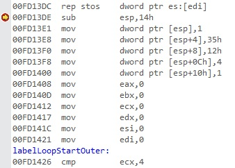

---
---


1 : We have the below program,  

```
#include "stdafx.h"
int _tmain(int argc, _TCHAR* argv[])
{
    __asm
	{
	    sub esp, 20
	}
    return 0;
}
```

Register values are the following,

EAX = CCCCCCCC EBX = 01055000 ECX = 00000000 EDX = 00000001 ESI = 00FD1078 EDI = 0133FB24 EIP = 00FD13DE ESP = 0133FA58 EBP = 0133FB24 EFL = 00000200

Relevant memory is the following,

0x0133FA38 00fd1078  
0x0133FA3C 01055000  
0x0133FA40 01560000  
0x0133FA44 015695d0  
0x0133FA48 f2b63fe4  
0x0133FA4C 01560000  
0x0133FA50 0133fa30  
0x0133FA54 0133fa74  
0x0133FA58 00fd1078  
0x0133FA5C 00fd1078  
0x0133FA60 01055000  

Disassembly is the following,  


What will be the value of ESP after the execution of the instruction sub esp, 20 in the above program?   

a) 0133FA58  
b) 0133FA54  
c) 0133FA48  
d) 0133FA44  

**Answer** d)

**Description** 

Sub esp, 20 means we are allocating 5 locations of stack memory 4 bytes each. So the value of ESP will be 0133FA44, which is evident from the stack memory locations given.  

---
---


2 : We have the below program,  

```
#include "stdafx.h"
int _tmain(int argc, _TCHAR* argv[])
{
    __asm
	{
	    sub esp, 20
	}
    return 0;
}
```

Register values are the following,

EAX = CCCCCCCC EBX = 01055000 ECX = 00000000 EDX = 00000001 ESI = 00FD1078 EDI = 0133FB24 EIP = 00FD13DE ESP = 0133FA58 EBP = 0133FB24 EFL = 00000200

Relevant memory is the following,

0x0133FA38 00fd1078  
0x0133FA3C 01055000  
0x0133FA40 01560000  
0x0133FA44 015695d0  
0x0133FA48 f2b63fe4  
0x0133FA4C 01560000  
0x0133FA50 0133fa30  
0x0133FA54 0133fa74  
0x0133FA58 00fd1078  
0x0133FA5C 00fd1078  
0x0133FA60 01055000  

Disassembly is the following,  


What will be the value of EIP after the execution of the instruction sub esp, 20 in the above program?  

a) 00FD13DE  
b) 00FD13E1  
c) 00FD13E8  
d) 00FD13F0  

**Answer** d)

**Description**

EIP will always point to next instruction which here is 00FD13E1 and it is evident from the disassembly shown.  

---
---


3 : We have the below program,  

```
#include "stdafx.h"
int _tmain(int argc, _TCHAR* argv[])
{
    __asm
	{
	    mov dword ptr[esp], 0x1
	}
    return 0;
}
```

Register values are the following,

EAX = CCCCCCCC EBX = 01055000 ECX = 00000000 EDX = 00000001 ESI = 00FD1078 EDI = 0133FB24 EIP = 00FD13E1 ESP = 0133FA44 EBP = 0133FB24 EFL = 00000200

Relevant memory is the following,

0x0133FA38 00fd1078  
0x0133FA3C 01055000  
0x0133FA40 01560000  
0x0133FA44 015695d0  
0x0133FA48 f2b63fe4  
0x0133FA4C 01560000  
0x0133FA50 0133fa30  
0x0133FA54 0133fa74  
0x0133FA58 00fd1078  
0x0133FA5C 00fd1078  
0x0133FA60 01055000  

Disassembly is the following,  


What will be the value of the memory location 0133FA44, after the execution of the instruction mov dword ptr[esp], 0x1?  

a) 00000001  
b) 0133FA44  
c) 00000035  
d) 00FD13E1  

**Answer** a)

**Description**

mov dword ptr[esp], 0x1 instruction will move the value 1 to the memory location [esp] that is 0133FA44.  

---
---


4 : We have the below program,  

```
#include "stdafx.h"
int _tmain(int argc, _TCHAR* argv[])
{
    __asm
	{
	    mov dword ptr[esp], 0x1
	}
    return 0;
}
```

Register values are the following,

EAX = CCCCCCCC EBX = 01055000 ECX = 00000000 EDX = 00000001 ESI = 00FD1078 EDI = 0133FB24 EIP = 00FD13E1 ESP = 0133FA44 EBP = 0133FB24 EFL = 00000200

Relevant memory is the following,

0x0133FA38 00fd1078  
0x0133FA3C 01055000  
0x0133FA40 01560000  
0x0133FA44 015695d0  
0x0133FA48 f2b63fe4  
0x0133FA4C 01560000  
0x0133FA50 0133fa30  
0x0133FA54 0133fa74  
0x0133FA58 00fd1078  
0x0133FA5C 00fd1078  
0x0133FA60 01055000  

Disassembly is the following,  



What will be the value of EIP after the execution of the instruction mov dword ptr[esp], 0x1?  

a) 00FD13DE  
b) 00FD13E1  
c) 00FD13E8  
d) 00FD13F0  

**Answer** c)

**Description**

EIP will always point to next instruction which here is 00FD13E8 and it is evident from the disassembly shown.  

---
---


5 : We have the below program,  

```
#include "stdafx.h"
int _tmain(int argc, _TCHAR* argv[])
{
    __asm
	{
	    mov dword ptr[esp + 4], 0x35
	}
    return 0;
}
```

Register values are the following,

EAX = CCCCCCCC EBX = 01055000 ECX = 00000000 EDX = 00000001 ESI = 00FD1078 EDI = 0133FB24 EIP = 00FD13E1 ESP = 0133FA44 EBP = 0133FB24 EFL = 00000200

Relevant memory is the following,

0x0133FA38 00fd1078  
0x0133FA3C 01055000  
0x0133FA40 01560000  
0x0133FA44 015695d0  
0x0133FA48 f2b63fe4  
0x0133FA4C 01560000  
0x0133FA50 0133fa30  
0x0133FA54 0133fa74  
0x0133FA58 00fd1078  
0x0133FA5C 00fd1078  
0x0133FA60 01055000  

Disassembly is the following,  


Value of which memory location will become 35 after the execution of the instruction mov dword ptr[esp + 4], 0x35?  

a) 0133FA44  
b) 0133FA48  
c) 0133FA4C  
d) 0133FA50  

**Answer** b)

**Description**

[esp + 4] is the next memory location after [esp], which is 0133FA48 and it is understood from the relevant memory locations shown and it will become 0x35.   

---
---


6 : We have the below program,  

```
#include "stdafx.h"
int _tmain(int argc, _TCHAR* argv[])
{
    __asm
	{
	    mov dword ptr[esp + 4], 0x35
	}
    return 0;
}
```

Register values are the following,

EAX = CCCCCCCC EBX = 01055000 ECX = 00000000 EDX = 00000001 ESI = 00FD1078 EDI = 0133FB24 EIP = 00FD13E1 ESP = 0133FA44 EBP = 0133FB24 EFL = 00000200

Relevant memory is the following,

0x0133FA38 00fd1078  
0x0133FA3C 01055000  
0x0133FA40 01560000  
0x0133FA44 015695d0  
0x0133FA48 f2b63fe4  
0x0133FA4C 01560000  
0x0133FA50 0133fa30  
0x0133FA54 0133fa74  
0x0133FA58 00fd1078  
0x0133FA5C 00fd1078  
0x0133FA60 01055000  

Disassembly is the following,  


What will be the value of EIP after the execution of the instruction mov dword ptr[esp + 4], 0x35?  

a) 00FD13DE  
b) 00FD13E1  
c) 00FD13E8  
d) 00FD13F0  

**Answer** d)

**Description**

EIP will always point to next instruction which here is 00FD13F0 and it is evident from the disassembly shown.  

---
---


7 : We have the below program,  

```
#include "stdafx.h"
int _tmain(int argc, _TCHAR* argv[])
{
    __asm
	{
	    mov dword ptr[esp + 8], 0x12
	}
    return 0;
}
```

Register values are the following,

EAX = CCCCCCCC EBX = 01055000 ECX = 00000000 EDX = 00000001 ESI = 00FD1078 EDI = 0133FB24 EIP = 00FD13E1 ESP = 0133FA44 EBP = 0133FB24 EFL = 00000200

Relevant memory is the following,

0x0133FA38 00fd1078  
0x0133FA3C 01055000  
0x0133FA40 01560000   
0x0133FA44 015695d0  
0x0133FA48 f2b63fe4  
0x0133FA4C 01560000  
0x0133FA50 0133fa30  
0x0133FA54 0133fa74  
0x0133FA58 00fd1078  
0x0133FA5C 00fd1078  
0x0133FA60 01055000  

Disassembly is the following,

What will be the value of the memory location 0133FA4C, after the execution of the instruction mov dword ptr[esp + 8], 0x12? 
