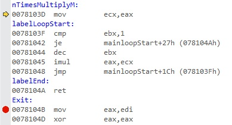
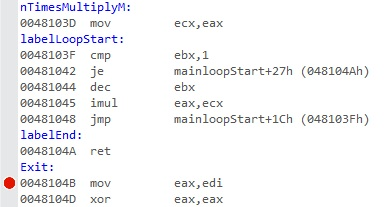
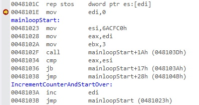

---
---


1 : We have the below program,  

```
#include "stdafx.h"
int _tmain(int argc, _TCHAR* argv[])
{
    __asm
    {
        mov edi, 0
    }
    return 0;
}
```

Register values are the following,

EAX = CCCCCCCC EBX = 00D3C000 ECX = 00000000 EDX = 00000001 ESI = 00211640 EDI = 00BAFAEC EIP = 0021101E ESP = 00BAFA20 EBP = 00BAFAEC EFL = 00000200

Relevant memory is the following,

0x00BAFA14 00e60000  
0x00BAFA18 00baf9f8  
0x00BAFA1C 00bafa3c  
0x00BAFA20 00211640  
0x00BAFA24 00211640  
0x00BAFA28 00d3c000  
0x00BAFA2C cccccccc  
0x00BAFA30 cccccccc  
0x00BAFA34 cccccccc  
0x00BAFA38 cccccccc  
0x00BAFA3C cccccccc  

What will be the value of EDI register after the execution of the instruction mov edi, 0?  

a) 00000000  
b) 00000001  
c) 00BAFAEC  
d) 00BAFA20  

**Answer** a) 

**Description**

Here we are moving the value 0 to EDI register by the instruction mov edi, 0, so it will become 00000000.  

---
---


2 : We have the below program,  

```
#include "stdafx.h"
int _tmain(int argc, _TCHAR* argv[])
{
    __asm
    {
        mov esi, 7000000
    }
    return 0;
}
```

Register values are the following,

EAX = CCCCCCCC EBX = 00D3C000 ECX = 00000000 EDX = 00000001 ESI = 00211640 EDI = 00BAFAEC EIP = 0021101E ESP = 00BAFA20 EBP = 00BAFAEC EFL = 00000200

Relevant memory is the following,

0x00BAFA14 00e60000  
0x00BAFA18 00baf9f8  
0x00BAFA1C 00bafa3c  
0x00BAFA20 00211640  
0x00BAFA24 00211640  
0x00BAFA28 00d3c000  
0x00BAFA2C cccccccc  
0x00BAFA30 cccccccc  
0x00BAFA34 cccccccc  
0x00BAFA38 cccccccc  
0x00BAFA3C cccccccc  

What will be the value of ESI register after the execution of the instruction mov esi, 7000000?  

a) 00000000  
b) 006ACFC0 (Hex value of 7000000)  
c) 00211640  
d) 00000007  

**Answer** b) 

**Description**  

Here we are moving the value 7000000 (Hex value is 006ACFC0) to ESI register by the instruction mov esi, 7000000, so it will become 006ACFC0.  

---
---


3 : We have the below program,  

```
#include "stdafx.h"
int _tmain(int argc, _TCHAR* argv[])
{
    __asm
    {
        mov eax, edi
    }
    return 0;
}
```

Register values are the following,

EAX = CCCCCCCC EBX = 00D3C000 ECX = 00000000 EDX = 00000001 ESI = 00211640 EDI = 00000000 EIP = 0021101E ESP = 00BAFA20 EBP = 00BAFAEC EFL = 00000200

Relevant memory is the following,

0x00BAFA14 00e60000  
0x00BAFA18 00baf9f8  
0x00BAFA1C 00bafa3c  
0x00BAFA20 00211640  
0x00BAFA24 00211640  
0x00BAFA28 00d3c000  
0x00BAFA2C cccccccc  
0x00BAFA30 cccccccc  
0x00BAFA34 cccccccc  
0x00BAFA38 cccccccc  
0x00BAFA3C cccccccc  

What will be the value of EAX register after the execution of the instruction mov eax, edi ?  

a) CCCCCCCC  
b) 00000001  
c) 00000000  
d) 00BAFA20  

**Answer** c) 

**Description**

Here we are moving the value in EDI register to EAX. EDI register has the value 0, as seen from the register values shown, so EAX register will become 00000000.   

---
---


4 : We have the below program,  

```
#include "stdafx.h"
int _tmain(int argc, _TCHAR* argv[])
{
    __asm
    {
        mov ebx, 3
    }
    return 0;
}
```

Register values are the following,

EAX = CCCCCCCC EBX = 00D3C000 ECX = 00000000 EDX = 00000001 ESI = 00211640 EDI = 00000000 EIP = 0021101E ESP = 00BAFA20 EBP = 00BAFAEC EFL = 00000200

Relevant memory is the following,

0x00BAFA14 00e60000  
0x00BAFA18 00baf9f8  
0x00BAFA1C 00bafa3c  
0x00BAFA20 00211640  
0x00BAFA24 00211640  
0x00BAFA28 00d3c000  
0x00BAFA2C cccccccc  
0x00BAFA30 cccccccc  
0x00BAFA34 cccccccc  
0x00BAFA38 cccccccc  
0x00BAFA3C cccccccc  

What will be the value of EBX register after the execution of the instruction mov ebx, 3?  

a) CCCCCCCC  
b) 00000003  
c) 00000000  
d) 00BAFA20  

**Answer** b) 

**Description**

Here we are moving the value 3 to EBX register by the instruction mov ebx, 3, so it will become 00000003.  

---
---


5 : We have the below program,  

```
#include "stdafx.h"
int _tmain(int argc, _TCHAR* argv[])
{
    __asm
    {
        mov edi, 0

    mainloopStart:

        mov esi, 7000000
        mov eax, edi
        mov ebx, 3
        call nTimesMultiplyM

    nTimesMultiplyM :

        mov ecx, eax
    }
    return 0;
}
```

Register values are the following,

EAX = 00000000 EBX = 00000003 ECX = 00000000 EDX = 00000001 ESI = 006ACFC0 EDI = 00000000 EIP = 00E8102F ESP = 0053F77C EBP = 0053F848 EFL = 00000204

Relevant memory is the following,

0x0053F770 0101f7cc  
0x0053F774 00810000  
0x0053F778 785e9d20  
0x0053F77C 00e81640  
0x0053F780 00e81640  
0x0053F784 002ff000  
0x0053F788 cccccccc  
0x0053F78C cccccccc  
0x0053F790 cccccccc  

Disassembly is the following,  


What will be the value of EIP register after the execution of the instruction mov edi, 0, in the above program?  

a) 00E81023  
b) 00E81028  
c) 00E8102A  
d) 00E8102F  

**Answer** a) 

**Description**

Value of EIP register will always be the EIP of the next instruction to execute which here is mov esi, 7000000 (Hex value is 006ACFC0), whose EIP is 00E81023 and it is evident from the disassembly shown.   

---
---


6 : We have the below program,  

```
#include "stdafx.h"
int _tmain(int argc, _TCHAR* argv[])
{
    __asm
    {
        mov edi, 0

    mainloopStart:

        mov esi, 7000000
        mov eax, edi
        mov ebx, 3
        call nTimesMultiplyM

    nTimesMultiplyM :

        mov ecx, eax
    }
    return 0;
}
```

Register values are the following,

EAX = 00000000 EBX = 00000003 ECX = 00000000 EDX = 00000001 ESI = 006ACFC0 EDI = 00000000 EIP = 00E8102F ESP = 0053F77C EBP = 0053F848 EFL = 00000204

Relevant memory is the following,

0x0053F770 0101f7cc  
0x0053F774 00810000  
0x0053F778 785e9d20  
0x0053F77C 00e81640  
0x0053F780 00e81640  
0x0053F784 002ff000  
0x0053F788 cccccccc  
0x0053F78C cccccccc  
0x0053F790 cccccccc  

Disassembly is the following,  


What will be the value of EIP register after the execution of the instruction mov esi, 7000000, in the above program?  

a) 00E81023  
b) 00E81028  
c) 00E8102A  
d) 00E8102F  

**Answer** b) 

**Description**

Value of EIP register will always be the EIP of the next instruction to execute, which here is mov eax, edi, whose EIP is 00E81028 and it is evident from the disassembly shown.   

---
---


7 : We have the below program,  

```
#include "stdafx.h"
int _tmain(int argc, _TCHAR* argv[])
{
    __asm
    {
        mov edi, 0

    mainloopStart:

        mov esi, 7000000
        mov eax, edi
        mov ebx, 3
        call nTimesMultiplyM

    nTimesMultiplyM :

        mov ecx, eax
    }
    return 0;
}
```

Register values are the following,

EAX = 00000000 EBX = 00000003 ECX = 00000000 EDX = 00000001 ESI = 006ACFC0 EDI = 00000000 EIP = 00E8102F ESP = 0053F77C EBP = 0053F848 EFL = 00000204

Relevant memory is the following,

0x0053F770 0101f7cc  
0x0053F774 00810000  
0x0053F778 785e9d20  
0x0053F77C 00e81640  
0x0053F780 00e81640  
0x0053F784 002ff000  
0x0053F788 cccccccc  
0x0053F78C cccccccc  
0x0053F790 cccccccc  

Disassembly is the following,  


What will be the value of EIP register after the execution of the instruction mov eax, edi, in the above program?  

a) 00E81023  
b) 00E81028  
c) 00E8102A  
d) 00E8102F  

**Answer** c) 

**Description**

Value of EIP register will always be the EIP of the next instruction to execute, which here is mov ebx, 3 whose EIP is 00E8102A and it is evident from the disassembly shown.   

---
---


8 : We have the below program,  

```
#include "stdafx.h"
int _tmain(int argc, _TCHAR* argv[])
{
    __asm
    {
        mov edi, 0

    mainloopStart:

        mov esi, 7000000
        mov eax, edi
        mov ebx, 3
        call nTimesMultiplyM

    nTimesMultiplyM :

        mov ecx, eax
    }
    return 0;
}
```

Register values are the following,

EAX = 00000000 EBX = 00000003 ECX = 00000000 EDX = 00000001 ESI = 006ACFC0 EDI = 00000000 EIP = 00E8102F ESP = 0053F77C EBP = 0053F848 EFL = 00000204

Relevant memory is the following,

0x0053F770 0101f7cc  
0x0053F774 00810000  
0x0053F778 785e9d20  
0x0053F77C 00e81640  
0x0053F780 00e81640  
0x0053F784 002ff000  
0x0053F788 cccccccc  
0x0053F78C cccccccc  
0x0053F790 cccccccc  

Disassembly is the following,  


What will be the value of EIP register after the execution of the instruction mov ebx, 3, in the above program?  

a) 00E81023  
b) 00E81028  
c) 00E8102A  
d) 00E8102F  

**Answer** d) 

**Description**

Value of EIP register will always be the EIP of the next instruction to execute, which here is call nTimesMultiplyM, whose EIP is 00E8102F and it is evident from the disassembly shown.   

---
---


9 : We have the below program,  

```
#include "stdafx.h"
int _tmain(int argc, _TCHAR* argv[])
{
    __asm
    {
        mov edi, 0

    mainloopStart:

        mov esi, 7000000
        mov eax, edi
        mov ebx, 3
        call nTimesMultiplyM

    nTimesMultiplyM :

        mov ecx, eax
    }
    return 0;
}
```

Register values are the following,

EAX = 00000000 EBX = 00000003 ECX = 00000000 EDX = 00000001 ESI = 006ACFC0 EDI = 00000000 EIP = 00E8102F ESP = 0053F77C EBP = 0053F848 EFL = 00000204

Relevant memory is the following,

0x0053F770 0101f7cc  
0x0053F774 00810000  
0x0053F778 785e9d20  
0x0053F77C 00e81640  
0x0053F780 00e81640  
0x0053F784 002ff000  
0x0053F788 cccccccc  
0x0053F78C cccccccc  
0x0053F790 cccccccc  

Disassembly is the following,  


What will be the value of ESP register after the execution of the instruction call nTimesMultiplyM, in the above program?  

a) 0053F77C  
b) 0053F780  
c) 0053F778  
d) 0053F774  

**Answer** c) 

**Description**

Call nTimesMultiplyM is effectively a combination of three instructions. First one is sub esp, 4, that is allocating stack memory. So here ESP will change and become 0053F778. Second one is mov dword ptr[esp], eip, that is moving the value of EIP of next instruction to that memory location. So value of that memory location will change. Third one is mov eip, address of nTimesMultiplyM. So EIP will also change.  

---
---


10 : We have the below program,  

```
#include "stdafx.h"
int _tmain(int argc, _TCHAR* argv[])
{
    __asm
    {
        mov edi, 0

    mainloopStart:

        mov esi, 7000000
        mov eax, edi
        mov ebx, 3
        call nTimesMultiplyM

    nTimesMultiplyM :

        mov ecx, eax
    }
    return 0;
}
```

Register values are the following,

EAX = 00000000 EBX = 00000003 ECX = 00000000 EDX = 00000001 ESI = 006ACFC0 EDI = 00000000 EIP = 00E8102F ESP = 0053F77C EBP = 0053F848 EFL = 00000204

Relevant memory is the following,

0x0053F770 0101f7cc  
0x0053F774 00810000  
0x0053F778 785e9d20  
0x0053F77C 00e81640  
0x0053F780 00e81640  
0x0053F784 002ff000  
0x0053F788 cccccccc  
0x0053F78C cccccccc  
0x0053F790 cccccccc  

Disassembly is the following,  


What will be the value of the memory location [esp] after the execution of the instruction call nTimesMultiplyM, in the above program if the value of ESP now is 0053F778?  

a) 00E8102F  
b) 00E81034  
c) 00E8103D  
d) 00E8102A  

**Answer** b) 

**Description**

Call nTimesMultiplyM is effectively a combination of three instructions. First one is sub esp, 4, that is allocating stack memory. So here ESP will change and become 0053F778. Second one is mov dword ptr[esp], eip, that is moving the value of EIP of next instruction (00E81034) to that memory location (0053F778). So value of that memory location will change. Third one is mov eip, address of nTimesMultiplyM. So EIP will also change.  

---
---


11 : We have the below program,  

```
#include "stdafx.h"
int _tmain(int argc, _TCHAR* argv[])
{
    __asm
    {
        mov edi, 0

    mainloopStart:

        mov esi, 7000000
        mov eax, edi
        mov ebx, 3
        call nTimesMultiplyM

    nTimesMultiplyM :

        mov ecx, eax
    }
    return 0;
}
```

Register values are the following,

EAX = 00000000 EBX = 00000003 ECX = 00000000 EDX = 00000001 ESI = 006ACFC0 EDI = 00000000 EIP = 00E8102F ESP = 0053F77C EBP = 0053F848 EFL = 00000204

Relevant memory is the following,

0x0053F770 0101f7cc  
0x0053F774 00810000  
0x0053F778 785e9d20   
0x0053F77C 00e81640  
0x0053F780 00e81640  
0x0053F784 002ff000  
0x0053F788 cccccccc  
0x0053F78C cccccccc  
0x0053F790 cccccccc  

Disassembly is the following,  


What will be the value of EIP register after the execution of the instruction call nTimesMultiplyM, in the above program?   

a) 00E8102F  
b) 00E81034  
c) 00E81036  
d) 00E8103D  

**Answer** d) 

**Description**

Call nTimesMultiplyM is effectively a combination of three instructions. First one is sub esp, 4, that is allocating stack memory. So here ESP will change and become 0053F778. Second one is mov dword ptr[esp], eip, that is moving the value of EIP of next instruction (00E81034) to that memory location (0053F778). So value of that memory location will change. Third one is mov eip, address of nTimesMultiplyM. So EIP will change and become 00E8103D which is evident from the disassembly shown.  

---
---


12 : We have the below program,  

```
#include "stdafx.h"
int _tmain(int argc, _TCHAR* argv[])
{
    __asm
    {
    nTimesMultiplyM :

        mov ecx, eax

    labelLoopStart :
        cmp ebx, 1
        jz labelEnd

        dec ebx
        imul eax, ecx
        jmp labelLoopStart

    labelEnd :
        ret
    }
    return 0;
}
```

Register values are the following,

EAX = 00000002 EBX = 00000003 ECX = 00000000 EDX = 00000001 ESI = 006ACFC0 EDI = 00000000 EIP = 0078103D ESP = 0135F764 EBP = 0135F834 EFL = 00000204

Relevant memory is the following,

0x0135F75C 014c0000  
0x0135F760 0135f740  
0x0135F764 00781034  
0x0135F768 00781640  
0x0135F76C 00781640   
0x0135F770 0119a000  
0x0135F774 cccccccc  
0x0135F778 cccccccc  
0x0135F77C cccccccc   
0x0135F780 cccccccc   

Disassembly is the following,  


 What will be the value of ECX register after the execution of the instruction, mov ecx, eax, in the above program?  

 a) 00000000  
 b) 00000002  
 c) 00000003  
 d) 00000004  

 **Answer** b) 

**Description**  

By the instruction mov ecx, eax, we are moving the value of EAX register to ECX register. The value of EAX register here is 2 which is evident from the register values shown above. So it will move to ECX register and will become 00000002.   

---
---


13 : We have the below program,  

```
#include "stdafx.h"
int _tmain(int argc, _TCHAR* argv[])
{
    __asm
    {
    nTimesMultiplyM :

        mov ecx, eax

    labelLoopStart :
        cmp ebx, 1
        jz labelEnd

        dec ebx
        imul eax, ecx
        jmp labelLoopStart

    labelEnd :
        ret
    }
    return 0;
}
```

Register values are the following,

EAX = 00000002 EBX = 00000003 ECX = 00000000 EDX = 00000001 ESI = 006ACFC0 EDI = 00000000 EIP = 0078103D ESP = 0135F764 EBP = 0135F834 EFL = 00000204

Relevant memory is the following,

0x0135F75C 014c0000  
0x0135F760 0135f740   
0x0135F764 00781034  
0x0135F768 00781640  
0x0135F76C 00781640  
0x0135F770 0119a000  
0x0135F774 cccccccc  
0x0135F778 cccccccc  
0x0135F77C cccccccc  
0x0135F780 cccccccc  

Disassembly is the following,  


 What will be the value of EIP register after the execution of the instruction, mov ecx, eax, in the above program?  

 a) 0078103D  
 b) 0078103F  
 c) 00781042  
 d) 00781044  

 **Answer** b) 

 **Description**   

 EIP register will always point to the next instruction which here is, cmp ebx, 1 whose EIP is 0078103F and it is evident from the disassembly shown.  

 ---
 ---


 14 : We have the below program,  

 ```
#include "stdafx.h"
int _tmain(int argc, _TCHAR* argv[])
{
    __asm
    {
    nTimesMultiplyM :

        mov ecx, eax

    labelLoopStart :
        cmp ebx, 1
        jz labelEnd

        dec ebx
        imul eax, ecx
        jmp labelLoopStart

    labelEnd :
        ret
    }
    return 0;
}
```

Register values are the following,

EAX = 00000002 EBX = 00000003 ECX = 00000000 EDX = 00000001 ESI = 006ACFC0 EDI = 00000000 EIP = 0078103D ESP = 0135F764 EBP = 0135F834 EFL = 00000204

Relevant memory is the following,

0x0135F75C 014c0000  
0x0135F760 0135f740  
0x0135F764 00781034  
0x0135F768 00781640  
0x0135F76C 00781640  
0x0135F770 0119a000  
0x0135F774 cccccccc  
0x0135F778 cccccccc  
0x0135F77C cccccccc  
0x0135F780 cccccccc  

Disassembly is the following,  


 What will be the value of EIP register after the execution of the instruction, cmp ebx, 1, in the above program?  

 a) 0078103D  
 b) 0078103F  
 c) 00781042  
 d) 00781044  

  **Answer** c) 

  **Description** 

 EIP register will always point to the next instruction which here is, jz labelEnd, whose EIP is 00781042 and it is evident from the disassembly shown.  

 ---
 ---


 15 : We have the below program,  

 ```
#include "stdafx.h"
int _tmain(int argc, _TCHAR* argv[])
{
    __asm
    {
    nTimesMultiplyM :

        mov ecx, eax

    labelLoopStart :
        cmp ebx, 1
        jz labelEnd

        dec ebx
        imul eax, ecx
        jmp labelLoopStart

    labelEnd :
        ret
    }
    return 0;
}
```

Register values are the following,

EAX = 00000002 EBX = 00000003 ECX = 00000000 EDX = 00000001 ESI = 006ACFC0 EDI = 00000000 EIP = 0078103D ESP = 0135F764 EBP = 0135F834 EFL = 00000204

Relevant memory is the following,

0x0135F75C 014c0000  
0x0135F760 0135f740  
0x0135F764 00781034  
0x0135F768 00781640  
0x0135F76C 00781640  
0x0135F770 0119a000  
0x0135F774 cccccccc  
0x0135F778 cccccccc  
0x0135F77C cccccccc  
0x0135F780 cccccccc  

Disassembly is the following,  


 What will be the value of EIP register after the execution of the instruction, jz labelEnd, in the above program?  

 a) 0078103D  
 b) 0078103F  
 c) 0078104A  
 d) 00781044  

  **Answer** d) 

 **Description**

 After the execution of the instruction jz labelEnd, it will not jump to labelEnd because the result of the previous operation is not equal to 0. Here as seen from the register values shown, value of EBX register is 3. So cmp ebx, 1 is, cmp 3, 1 that is 3 – 1 and it is not equal to 0. So it will not jump but execute the next instruction which is, dec ebx, whose EIP is 00781044 and it is evident from the disassembly shown. Je is same as jz because jump on zero (jz) means that both values are equal (je).        

 ---
 ---


 16 : We have the below program,  

 ```
#include "stdafx.h"
int _tmain(int argc, _TCHAR* argv[])
{
    __asm
    {
    nTimesMultiplyM :

        mov ecx, eax

    labelLoopStart :
        cmp ebx, 1
        jz labelEnd

        dec ebx
        imul eax, ecx
        jmp labelLoopStart

    labelEnd :
        ret
    }
    return 0;
}
```

Register values are the following,

EAX = 00000002 EBX = 00000003 ECX = 00000000 EDX = 00000001 ESI = 006ACFC0 EDI = 00000000 EIP = 0078103D ESP = 0135F764 EBP = 0135F834 EFL = 00000204

Relevant memory is the following,

0x0135F75C 014c0000  
0x0135F760 0135f740  
0x0135F764 00781034  
0x0135F768 00781640  
0x0135F76C 00781640  
0x0135F770 0119a000  
0x0135F774 cccccccc  
0x0135F778 cccccccc  
0x0135F77C cccccccc  
0x0135F780 cccccccc  

Disassembly is the following,  


 What will be the value of EBX register after the execution of the instruction, dec ebx, in the above program?  

 a) 00000003  
 b) 00000004  
 c) 00000005  
 d) 00000002  

 **Answer** d) 

**Description**  

The instruction dec ebx will reduce the value of EBX register by 1. The value of the EBX register is 3 as evident from the register values shown above. So it will become 3 – 1 which is equal to 00000002.  

---
---


17 : We have the below program,  

```
#include "stdafx.h"
int _tmain(int argc, _TCHAR* argv[])
{
    __asm
    {
    nTimesMultiplyM :

        mov ecx, eax

    labelLoopStart :
        cmp ebx, 1
        jz labelEnd

        dec ebx
        imul eax, ecx
        jmp labelLoopStart

    labelEnd :
        ret
    }
    return 0;
}
```

Register values are the following,

EAX = 00000002 EBX = 00000003 ECX = 00000000 EDX = 00000001 ESI = 006ACFC0 EDI = 00000000 EIP = 0078103D ESP = 0135F764 EBP = 0135F834 EFL = 00000204

Relevant memory is the following,

0x0135F75C 014c0000  
0x0135F760 0135f740  
0x0135F764 00781034  
0x0135F768 00781640  
0x0135F76C 00781640  
0x0135F770 0119a000  
0x0135F774 cccccccc  
0x0135F778 cccccccc  
0x0135F77C cccccccc  
0x0135F780 cccccccc  

Disassembly is the following,  


 What will be the value of EIP register after the execution of the instruction, dec ebx, in the above program?  

 a) 00781044  
 b) 00781045  
 c) 00781048  
 d) 0078104A  

 **Answer** b) 

**Description**

EIP register will always point to the next instruction which here is, imul eax, ecx, whose EIP is 00781045 and it is evident from the disassembly shown.  

---
---


18 : We have the below program,  

```
#include "stdafx.h"
int _tmain(int argc, _TCHAR* argv[])
{
    __asm
    {
    nTimesMultiplyM :

        mov ecx, eax

    labelLoopStart :
        cmp ebx, 1
        jz labelEnd

        dec ebx
        imul eax, ecx
        jmp labelLoopStart

    labelEnd :
        ret
    }
    return 0;
}
```

Register values are the following,

EAX = 00000002 EBX = 00000003 ECX = 00000002 EDX = 00000001 ESI = 006ACFC0 EDI = 00000000 EIP = 0078103D ESP = 0135F764 EBP = 0135F834 EFL = 00000204

Relevant memory is the following,

0x0135F75C 014c0000  
0x0135F760 0135f740  
0x0135F764 00781034  
0x0135F768 00781640  
0x0135F76C 00781640  
0x0135F770 0119a000  
0x0135F774 cccccccc  
0x0135F778 cccccccc  
0x0135F77C cccccccc  
0x0135F780 cccccccc  

Disassembly is the following,  


 What will be the value of EAX register after the execution of the instruction, imul eax, ecx, in the above program?   

 a) 00000002  
 b) 00000004  
 c) 00000008  
 d) 00000016  

  **Answer** b) 

**Description**

imul eax, ecx will multiply the value of EAX and ECX registers and save it in EAX register. Value of EAX register is 2 and the value of ECX register is also 2 as shown in the register values above. So the new value of EAX register will be 2 * 2 which is 00000004.  

---
---


19 : We have the below program,  

```
#include "stdafx.h"
int _tmain(int argc, _TCHAR* argv[])
{
    __asm
    {
    nTimesMultiplyM :

        mov ecx, eax

    labelLoopStart :
        cmp ebx, 1
        jz labelEnd

        dec ebx
        imul eax, ecx
        jmp labelLoopStart

    labelEnd :
        ret
    }
    return 0;
}
```

Register values are the following,

EAX = 00000002 EBX = 00000003 ECX = 00000000 EDX = 00000001 ESI = 006ACFC0 EDI = 00000000 EIP = 0078103D ESP = 0135F764 EBP = 0135F834 EFL = 00000204

Relevant memory is the following,

0x0135F75C 014c0000  
0x0135F760 0135f740  
0x0135F764 00781034  
0x0135F768 00781640  
0x0135F76C 00781640  
0x0135F770 0119a000  
0x0135F774 cccccccc  
0x0135F778 cccccccc  
0x0135F77C cccccccc  
0x0135F780 cccccccc  

Disassembly is the following,  


 What will be the value of EIP register after the execution of the instruction, imul eax, ecx, in the above program?  

 a) 00781044  
 b) 00781045  
 c) 00781048  
 d) 0078104A  

   **Answer** c) 

**Description**

EIP register will always point to the next instruction which here is, jmp labelLoopStart, whose EIP is 00781048 and it is evident from the disassembly shown.  

---
---


20 : We have the below program,  

```
#include "stdafx.h"
int _tmain(int argc, _TCHAR* argv[])
{
    __asm
    {
    nTimesMultiplyM :

        mov ecx, eax

    labelLoopStart :
        cmp ebx, 1
        jz labelEnd

        dec ebx
        imul eax, ecx
        jmp labelLoopStart

    labelEnd :
        ret
    }
    return 0;
}
```

Register values are the following,

EAX = 00000002 EBX = 00000003 ECX = 00000000 EDX = 00000001 ESI = 006ACFC0 EDI = 00000000 EIP = 0078103D ESP = 0135F764 EBP = 0135F834 EFL = 00000204

Relevant memory is the following,

0x0135F75C 014c0000  
0x0135F760 0135f740  
0x0135F764 00781034  
0x0135F768 00781640  
0x0135F76C 00781640  
0x0135F770 0119a000  
0x0135F774 cccccccc  
0x0135F778 cccccccc  
0x0135F77C cccccccc  
0x0135F780 cccccccc  

Disassembly is the following,  


 What will be the value of EIP register after the execution of the instruction, jmp labelLoopStart, in the above program?  

 a) 0078103F  
 b) 00781045  
 c) 00781048  
 d) 0078104A  

  **Answer** a) 

**Description**

jmp labelLoopStart is an unconditional jump and it will jump to labelLoopStart, whose EIP here is 0078103F as evident from the disassembly shown.  

---
---


21 : We have the below program,  

```
#include "stdafx.h"
int _tmain(int argc, _TCHAR* argv[])
{
    __asm
    {
    nTimesMultiplyM :

        mov ecx, eax

    labelLoopStart :
        cmp ebx, 1
        jz labelEnd

        dec ebx
        imul eax, ecx
        jmp labelLoopStart

    labelEnd :
        ret
    }
    return 0;
}
```

Register values are the following,

EAX = 00000004 EBX = 00000002 ECX = 00000002 EDX = 00000001 ESI = 006ACFC0 EDI = 00000000 EIP = 0078103D ESP = 0135F764 EBP = 0135F834 EFL = 00000204

Relevant memory is the following,

0x0135F75C 014c0000  
0x0135F760 0135f740  
0x0135F764 00781034  
0x0135F768 00781640  
0x0135F76C 00781640  
0x0135F770 0119a000  
0x0135F774 cccccccc  
0x0135F778 cccccccc  
0x0135F77C cccccccc  
0x0135F780 cccccccc  

Disassembly is the following,  


What will be the value of EIP register after the execution of the instruction, jz labelEnd, in the above program?  

a) 0078103D  
b) 0078103F  
c) 0078104A  
d) 00781044  

 **Answer** d) 

**Description**

After the execution of the instruction jz labelEnd, it will not jump to labelEnd because the result of the previous operation is not equal to 0. Here as seen from the register values shown, value of EBX register is 2. So cmp ebx, 1 is, cmp 2, 1 that is 2 – 1 and it is not equal to 0. So it will not jump but execute the next instruction which is, dec ebx, whose EIP is 00781044 and it is evident from the disassembly shown. Je is same as jz because jump on zero (jz) means that both values are equal (je).    

---
---


22 : We have the below program,  

```
#include "stdafx.h"
int _tmain(int argc, _TCHAR* argv[])
{
    __asm
    {
    nTimesMultiplyM :

        mov ecx, eax

    labelLoopStart :
        cmp ebx, 1
        jz labelEnd

        dec ebx
        imul eax, ecx
        jmp labelLoopStart

    labelEnd :
        ret
    }
    return 0;
}
```

Register values are the following,

EAX = 00000004 EBX = 00000002 ECX = 00000002 EDX = 00000001 ESI = 006ACFC0 EDI = 00000000 EIP = 0078103D ESP = 0135F764 EBP = 0135F834 EFL = 00000204

Relevant memory is the following,

0x0135F75C 014c0000  
0x0135F760 0135f740  
0x0135F764 00781034  
0x0135F768 00781640  
0x0135F76C 00781640  
0x0135F770 0119a000  
0x0135F774 cccccccc  
0x0135F778 cccccccc  
0x0135F77C cccccccc  
0x0135F780 cccccccc  

Disassembly is the following,  


What will be the value of EBX register after the execution of the instruction, dec ebx, in the above program?  

a) 00000002  
b) 00000003  
c) 00000004  
d) 00000001  

 **Answer** d) 

**Description**

The instruction dec ebx will reduce the value of EBX register by 1. The value of the EBX register is 2 as evident from the register values shown above. So it will become 2 – 1 which is equal to 00000001.  

---
---


23 : We have the below program,  

```
#include "stdafx.h"
int _tmain(int argc, _TCHAR* argv[])
{
    __asm
    {
    nTimesMultiplyM :

        mov ecx, eax

    labelLoopStart :
        cmp ebx, 1
        jz labelEnd

        dec ebx
        imul eax, ecx
        jmp labelLoopStart

    labelEnd :
        ret
    }
    return 0;
}
```

Register values are the following,

EAX = 00000004 EBX = 00000002 ECX = 00000002 EDX = 00000001 ESI = 006ACFC0 EDI = 00000000 EIP = 0078103D ESP = 0135F764 EBP = 0135F834 EFL = 00000204

Relevant memory is the following,

0x0135F75C 014c0000  
0x0135F760 0135f740  
0x0135F764 00781034  
0x0135F768 00781640  
0x0135F76C 00781640  
0x0135F770 0119a000  
0x0135F774 cccccccc  
0x0135F778 cccccccc  
0x0135F77C cccccccc  
0x0135F780 cccccccc  

Disassembly is the following,   



What will be the value of EAX register after the execution of the instruction, imul eax, ecx, in the above program?  

a) 00000002  
b) 00000004  
c) 00000008  
d) 00000016  

 **Answer** c) 

**Description**

imul eax, ecx will multiply the value of EAX and ECX registers and save it in EAX register. Value of EAX register is 4 and the value of ECX register is 2 as shown in the register values above. So the new value of EAX register will be 4 * 2 which is 00000008.  

---
---


24 : We have the below program,  

```
#include "stdafx.h"
int _tmain(int argc, _TCHAR* argv[])
{
    __asm
    {
    nTimesMultiplyM :

        mov ecx, eax

    labelLoopStart :
        cmp ebx, 1
        jz labelEnd

        dec ebx
        imul eax, ecx
        jmp labelLoopStart

    labelEnd :
        ret
    }
    return 0;
}
```

Register values are the following,

EAX = 00000008 EBX = 00000001 ECX = 00000002 EDX = 00000001 ESI = 006ACFC0 EDI = 00000000 EIP = 0078103D ESP = 0135F764 EBP = 0135F834 EFL = 00000204

Relevant memory is the following,

0x0135F75C 014c0000  
0x0135F760 0135f740  
0x0135F764 00781034  
0x0135F768 00781640  
0x0135F76C 00781640  
0x0135F770 0119a000  
0x0135F774 cccccccc  
0x0135F778 cccccccc  
0x0135F77C cccccccc  
0x0135F780 cccccccc  

Disassembly is the following,  


 What will be the value of EIP register after the execution of the instruction, jz labelEnd, in the above program?  

 a) 0078103D  
 b) 0078103F  
 c) 0078104A  
 d) 00781044  

  **Answer** c) 

**Description**

After the execution of the instruction jz labelEnd, it will jump to labelEnd because the result of the previous operation is equal to 0. Here as seen from the register values shown, value of EBX register is 1. So cmp ebx, 1 is, cmp 1, 1 that is 1 – 1 and it is equal to 0. So it will jump to labelEnd, whose EIP is 0078104A and it is evident from the disassembly shown.    

---
---


25 : We have the below program,  

```
#include "stdafx.h"
int _tmain(int argc, _TCHAR* argv[])
{
    __asm
    {
        mov edi, 0

    mainloopStart :
        mov esi, 7000000
        mov eax, edi
        mov ebx, 3
        call nTimesMultiplyM

        cmp eax, esi
        jb IncrementCounterAndStartOver
        jmp Exit

    IncrementCounterAndStartOver :
        inc edi
        jmp mainloopStart

    nTimesMultiplyM :
        mov ecx, eax

    labelLoopStart :
        cmp ebx, 1
        jz labelEnd

        dec ebx
        imul eax, ecx
        jmp labelLoopStart

    labelEnd :
        ret

    Exit :
        mov eax, edi
    }
    return 0;
}
```

Register values are the following,

EAX = 00000000 EBX = 00B7C000 ECX = 00000000 EDX = 00000001 ESI = 006ACFC0 (Hex value of 7000000) EDI = 00000000 EIP = 0048101E ESP = 00D8FDEC EBP = 00D8FEB8 EFL = 00000200

Relevant memory is the following,

0x00D8FDE0 0101fe3c  
0x00D8FDE4 01050000  
0x00D8FDE8 78f69d20  
0x00D8FDEC 00481640  
0x00D8FDF0 00481640  
0x00D8FDF4 00b7c000  
0x00D8FDF8 cccccccc  
0x00D8FDFC cccccccc  
0x00D8FE00 cccccccc  

Disassembly is the following,   


What will be the value of EIP register after the execution of the instruction, jb IncrementCounterAndStartOver, in the above program?  

a) 00481038  
b) 0048103A  
c) 0048103B  
d) 00481023  

  **Answer** b) 

**Description**

jb IncrementCounterAndStartOver is jump if below to IncrementCounterAndStartOver. Here as seen from the register values shown, the value of EAX register is 0 and the value of ESI register is 006ACFC0 (Hex value of 7000000). So cmp eax, esi will be cmp 0, 006ACFC0 and 0 is below 006ACFC0 andso it will jump to IncrementCounterAndStartOver, whose EIP is 0048103A, which is evident from the disassembly shown.  

---
---


26 : We have the below program,  

```
#include "stdafx.h"
int _tmain(int argc, _TCHAR* argv[])
{
    __asm
    {
        mov edi, 0

    mainloopStart :
        mov esi, 7000000
        mov eax, edi
        mov ebx, 3
        call nTimesMultiplyM

        cmp eax, esi
        jb IncrementCounterAndStartOver
        jmp Exit

    IncrementCounterAndStartOver :
        inc edi
        jmp mainloopStart

    nTimesMultiplyM :
        mov ecx, eax

    labelLoopStart :
        cmp ebx, 1
        jz labelEnd

        dec ebx
        imul eax, ecx
        jmp labelLoopStart

    labelEnd :
        ret

    Exit :
        mov eax, edi
    }
    return 0;
}
```

Register values are the following,

EAX = 00000000 EBX = 00B7C000 ECX = 00000000 EDX = 00000001 ESI = 006ACFC0 (Hex value of 7000000) EDI = 00000000 EIP = 0048101E ESP = 00D8FDEC EBP = 00D8FEB8 EFL = 00000200

Relevant memory is the following,

0x00D8FDE0 0101fe3c  
0x00D8FDE4 01050000  
0x00D8FDE8 78f69d20  
0x00D8FDEC 00481640  
0x00D8FDF0 00481640  
0x00D8FDF4 00b7c000  
0x00D8FDF8 cccccccc  
0x00D8FDFC cccccccc  
0x00D8FE00 cccccccc  

Disassembly is the following,  

  


What will be the value of EDI register after the execution of the instruction, inc edi in the above program?  

a) 00000000  
b) 00000001  
c) 00000002  
d) 00000003  

  **Answer** b) 

**Description**

Here as seen from the register values shown, the value of EDI register is 0. Inc edi instruction will increment the value of EDI register by 1, andso it will become 00000001.  

---
---


27 : We have the below program,  

```
#include "stdafx.h"
int _tmain(int argc, _TCHAR* argv[])
{
    __asm
    {
        mov edi, 0

    mainloopStart :
        mov esi, 7000000
        mov eax, edi
        mov ebx, 3
        call nTimesMultiplyM

        cmp eax, esi
        jb IncrementCounterAndStartOver
        jmp Exit

    IncrementCounterAndStartOver :
        inc edi
        jmp mainloopStart

    nTimesMultiplyM :
        mov ecx, eax

    labelLoopStart :
        cmp ebx, 1
        jz labelEnd

        dec ebx
        imul eax, ecx
        jmp labelLoopStart

    labelEnd :
        ret

    Exit :
        mov eax, edi
    }
    return 0;
}
```

Register values are the following,

EAX = 00000000 EBX = 00B7C000 ECX = 00000000 EDX = 00000001 ESI = 006ACFC0 (Hex value of 7000000) EDI = 00000000 EIP = 0048101E ESP = 00D8FDEC EBP = 00D8FEB8 EFL = 00000200

Relevant memory is the following,

0x00D8FDE0 0101fe3c  
0x00D8FDE4 01050000  
0x00D8FDE8 78f69d20  
0x00D8FDEC 00481640  
0x00D8FDF0 00481640  
0x00D8FDF4 00b7c000   
0x00D8FDF8 cccccccc  
0x00D8FDFC cccccccc  
0x00D8FE00 cccccccc  

Disassembly is the following,  

  


What will be the value of EIP register after the execution of the instruction, inc edi in the above program?  

a) 00481038  
b) 0048103A  
c) 0048103B  
d) 00481023  

  **Answer** c) 

**Description**

EIP register will always point to the next instruction which here is, jmp mainloopStart, whose EIP is 0048103B and it is evident from the disassembly shown.  

---
---


28 : We have the below program,  

```
#include "stdafx.h"
int _tmain(int argc, _TCHAR* argv[])
{
    __asm
    {
        mov edi, 0

    mainloopStart :
        mov esi, 7000000
        mov eax, edi
        mov ebx, 3
        call nTimesMultiplyM

        cmp eax, esi
        jb IncrementCounterAndStartOver
        jmp Exit

    IncrementCounterAndStartOver :
        inc edi
        jmp mainloopStart

    nTimesMultiplyM :
        mov ecx, eax

    labelLoopStart :
        cmp ebx, 1
        jz labelEnd

        dec ebx
        imul eax, ecx
        jmp labelLoopStart

    labelEnd :
        ret

    Exit :
        mov eax, edi
    }
    return 0;
}
```

Register values are the following,

EAX = 00000000 EBX = 00B7C000 ECX = 00000000 EDX = 00000001 ESI = 006ACFC0 (Hex value of 7000000) EDI = 00000000 EIP = 0048101E ESP = 00D8FDEC EBP = 00D8FEB8 EFL = 00000200

Relevant memory is the following,

0x00D8FDE0 0101fe3c  
0x00D8FDE4 01050000  
0x00D8FDE8 78f69d20  
0x00D8FDEC 00481640  
0x00D8FDF0 00481640  
0x00D8FDF4 00b7c000  
0x00D8FDF8 cccccccc  
0x00D8FDFC cccccccc  
0x00D8FE00 cccccccc  

Disassembly is the following,  

  


What will be the value of EIP register after the execution of the instruction, jmp mainloopStart, in the above program?  

a) 00481038  
b) 0048103A  
c) 0048103B  
d) 00481023  

  **Answer** d) 

**Description**

jmp mainloopStart is an unconditional jump and it will jump to mainloopStart, whose EIP is 00481023, which is evident from the disassembly shown.  

---
---


29 : We have the below program,  

```
#include "stdafx.h"
int _tmain(int argc, _TCHAR* argv[])
{
    __asm
    {
    mainloopStart :
        mov esi, 7000000
        mov eax, edi
        mov ebx, 3
        call nTimesMultiplyM

        cmp eax, esi
        jb IncrementCounterAndStartOver
        jmp Exit

    IncrementCounterAndStartOver :
        inc edi
        jmp mainloopStart

    nTimesMultiplyM :
        mov ecx, eax

    labelLoopStart :
        cmp ebx, 1
        jz labelEnd

        dec ebx
        imul eax, ecx
        jmp labelLoopStart

    labelEnd :
        ret

    Exit :
        mov eax, edi
    }
    return 0;
}
```

Register values are the following,

EAX = 00000000 EBX = 00B7C000 ECX = 00000000 EDX = 00000001 ESI = 006ACFC0 (Hex value of 7000000) EDI = 00000001 EIP = 0048101E ESP = 00D8FDEC EBP = 00D8FEB8 EFL = 00000200

Relevant memory is the following,

0x00D8FDE0 0101fe3c  
0x00D8FDE4 01050000  
0x00D8FDE8 78f69d20  
0x00D8FDEC 00481640  
0x00D8FDF0 00481640  
0x00D8FDF4 00b7c000  
0x00D8FDF8 cccccccc  
0x00D8FDFC cccccccc  
0x00D8FE00 cccccccc  

Disassembly is the following,  

  


What will be the value of EAX register after the execution of the instruction, mov eax, edi in the above program?  

a) 00000000  
b) 00000001  
c) 00000002  
d) 00000003  

  **Answer** b) 

**Description**

The instruction, mov eax, edi will move the value of EDI register to EAX register. Here the value of EDI register is 1 as seen from the register values given, that will move to EAX register and it will become 00000001.  

---
---


30 : We have the below program,  

```
#include "stdafx.h"
int _tmain(int argc, _TCHAR* argv[])
{
    __asm
    {
    mainloopStart :
        mov esi, 7000000
        mov eax, edi
        mov ebx, 3
        call nTimesMultiplyM

        cmp eax, esi
        jb IncrementCounterAndStartOver
        jmp Exit

    IncrementCounterAndStartOver :
        inc edi
        jmp mainloopStart

    nTimesMultiplyM :
        mov ecx, eax

    labelLoopStart :
        cmp ebx, 1
        jz labelEnd

        dec ebx
        imul eax, ecx
        jmp labelLoopStart

    labelEnd :
        ret

    Exit :
        mov eax, edi
    }
    return 0;
}
```

Register values are the following,

EAX = 00000001 EBX = 00B7C000 ECX = 00000000 EDX = 00000001 ESI = 006ACFC0 (Hex value of 7000000) EDI = 00000001 EIP = 0048101E ESP = 00D8FDEC EBP = 00D8FEB8 EFL = 00000200

Relevant memory is the following,

0x00D8FDE0 0101fe3c   
0x00D8FDE4 01050000  
0x00D8FDE8 78f69d20  
0x00D8FDEC 00481640  
0x00D8FDF0 00481640  
0x00D8FDF4 00b7c000  
0x00D8FDF8 cccccccc  
0x00D8FDFC cccccccc  
0x00D8FE00 cccccccc  

Disassembly is the following,  

  


What will be the value of ESP register after the execution of the instruction call nTimesMultiplyM, in the above program?  

a) 00D8FDEC  
b) 00D8FDE8  
c) 00D8FDF0  
d) 00D8FDE4  

  **Answer** b) 

**Description**

Call nTimesMultiplyM is effectively a combination of three instructions. First one is sub esp, 4, that is allocating stack memory. So here ESP will change and become 00D8FDE8. Second one is mov dword ptr[esp], eip, that is moving the value of EIP of next instruction to that memory location. So value of that memory location will change. Third one is mov eip, address of nTimesMultiplyM. So EIP will also change.  

---
---


31 : We have the below program,  

```
#include "stdafx.h"
int _tmain(int argc, _TCHAR* argv[])
{
    __asm
    {
    mainloopStart :
        mov esi, 7000000
        mov eax, edi
        mov ebx, 3
        call nTimesMultiplyM

        cmp eax, esi
        jb IncrementCounterAndStartOver
        jmp Exit

    IncrementCounterAndStartOver :
        inc edi
        jmp mainloopStart

    nTimesMultiplyM :
        mov ecx, eax

    labelLoopStart :
        cmp ebx, 1
        jz labelEnd

        dec ebx
        imul eax, ecx
        jmp labelLoopStart

    labelEnd :
        ret

    Exit :
        mov eax, edi
    }
    return 0;
}
```

Register values are the following,

EAX = 00000001 EBX = 00B7C000 ECX = 00000000 EDX = 00000001 ESI = 006ACFC0 (Hex value of 7000000) EDI = 00000001 EIP = 0048101E ESP = 00D8FDEC EBP = 00D8FEB8 EFL = 00000200

Relevant memory is the following,

0x00D8FDE0 0101fe3c  
0x00D8FDE4 01050000  
0x00D8FDE8 78f69d20  
0x00D8FDEC 00481640  
0x00D8FDF0 00481640  
0x00D8FDF4 00b7c000  
0x00D8FDF8 cccccccc  
0x00D8FDFC cccccccc  
0x00D8FE00 cccccccc  

Disassembly is the following,  

  


What will be the value of the memory location [esp] after the execution of the instruction call nTimesMultiplyM, in the above program if the value of ESP now is 00D8FDE8?  

a) 0048102F  
b) 00481034  
c) 00481036  
d) 0048103D  

  **Answer** b) 

**Description**

Call nTimesMultiplyM is effectively a combination of three instructions. First one is sub esp, 4, that is allocating stack memory. So here ESP will change and become 00D8FDE8. Second one is mov dword ptr[esp], eip, that is moving the value of EIP of next instruction (00481034) to that memory location (00D8FDE8). So value of that memory location will change. Third one is mov eip, address of nTimesMultiplyM. So EIP will also change.  

---
---


32 : We have the below program,  

```
#include "stdafx.h"
int _tmain(int argc, _TCHAR* argv[])
{
    __asm
    {
    mainloopStart :
        mov esi, 7000000
        mov eax, edi
        mov ebx, 3
        call nTimesMultiplyM

        cmp eax, esi
        jb IncrementCounterAndStartOver
        jmp Exit

    IncrementCounterAndStartOver :
        inc edi
        jmp mainloopStart

    nTimesMultiplyM :
        mov ecx, eax

    labelLoopStart :
        cmp ebx, 1
        jz labelEnd

        dec ebx
        imul eax, ecx
        jmp labelLoopStart

    labelEnd :
        ret

    Exit :
        mov eax, edi
    }
    return 0;
}
```

Register values are the following,

EAX = 00000001 EBX = 00B7C000 ECX = 00000000 EDX = 00000001 ESI = 006ACFC0 (Hex value of 7000000) EDI = 00000001 EIP = 0048101E ESP = 00D8FDEC EBP = 00D8FEB8 EFL = 00000200

Relevant memory is the following,

0x00D8FDE0 0101fe3c     
0x00D8FDE4 01050000    
0x00D8FDE8 78f69d20  
0x00D8FDEC 00481640  
0x00D8FDF0 00481640  
0x00D8FDF4 00b7c000  
0x00D8FDF8 cccccccc  
0x00D8FDFC cccccccc  
0x00D8FE00 cccccccc  

Disassembly is the following,  

  


What will be the value of EIP register after the execution of the instruction call nTimesMultiplyM, in the above program?  

a) 0048102F  
b) 00481034  
c) 00481036  
d) 0048103D  

  **Answer** d) 

**Description**

Call nTimesMultiplyM is effectively a combination of three instructions. First one is sub esp, 4, that is allocating stack memory. So here ESP will change and become 00D8FDE8. Second one is mov dword ptr[esp], eip, that is moving the value of EIP of next instruction (00481034) to that memory location (00D8FDE8). So value of that memory location will change. Third one is mov eip, address of nTimesMultiplyM. So EIP will change and become 0048103D, which is evident from the disassembly shown.  

---
---


33 : We have the below program,  

```
#include "stdafx.h"
int _tmain(int argc, _TCHAR* argv[])
{
    __asm
    {
    mainloopStart :
        mov esi, 7000000
        mov eax, edi
        mov ebx, 3
        call nTimesMultiplyM

        cmp eax, esi
        jb IncrementCounterAndStartOver
        jmp Exit

    IncrementCounterAndStartOver :
        inc edi
        jmp mainloopStart

    nTimesMultiplyM :
        mov ecx, eax

    labelLoopStart :
        cmp ebx, 1
        jz labelEnd

        dec ebx
        imul eax, ecx
        jmp labelLoopStart

    labelEnd :
        ret

    Exit :
        mov eax, edi
    }
    return 0;
}
```

Register values are the following,

EAX = 00000001 EBX = 00B7C000 ECX = 00000000 EDX = 00000001 ESI = 006ACFC0 (Hex value of 7000000) EDI = 00000001 EIP = 0048101E ESP = 00D8FDE8 EBP = 00D8FEB8 EFL = 00000200

Relevant memory is the following,

0x00D8FDE0 0101fe3c  
0x00D8FDE4 01050000  
0x00D8FDE8 78f69d20  
0x00D8FDEC 00481640  
0x00D8FDF0 00481640  
0x00D8FDF4 00b7c000  
0x00D8FDF8 cccccccc  
0x00D8FDFC cccccccc  
0x00D8FE00 cccccccc  

Disassembly is the following,  

  


What will be the value of ECX register after the execution of the instruction, mov ecx, eax, in the above program?  

a) 00000000  
b) 00000001  
c) 00000002  
d) 00000003  

  **Answer** b) 

**Description**

By the instruction mov ecx, eax, we are moving the value of EAX register to ECX register. The value of EAX register here is 1 which is evident from the register values shown above. So it will move to ECX register and will become 00000001.   

---
---


34 : We have the below program,  

```
#include "stdafx.h"
int _tmain(int argc, _TCHAR* argv[])
{
    __asm
    {
    mainloopStart :
        mov esi, 7000000
        mov eax, edi
        mov ebx, 3
        call nTimesMultiplyM

        cmp eax, esi
        jb IncrementCounterAndStartOver
        jmp Exit

    IncrementCounterAndStartOver :
        inc edi
        jmp mainloopStart

    nTimesMultiplyM :
        mov ecx, eax

    labelLoopStart :
        cmp ebx, 1
        jz labelEnd

        dec ebx
        imul eax, ecx
        jmp labelLoopStart

    labelEnd :
        ret

    Exit :
        mov eax, edi
    }
    return 0;
}
```

Register values are the following,

EAX = 00000001 EBX = 00000003 ECX = 00000001 EDX = 00000001 ESI = 006ACFC0 (Hex value of 7000000) EDI = 00000001 EIP = 0048101E ESP = 00D8FDE8 EBP = 00D8FEB8 EFL = 00000200

Relevant memory is the following,

0x00D8FDE0 0101fe3c  
0x00D8FDE4 01050000  
0x00D8FDE8 78f69d20  
0x00D8FDEC 00481640  
0x00D8FDF0 00481640  
0x00D8FDF4 00b7c000  
0x00D8FDF8 cccccccc  
0x00D8FDFC cccccccc  
0x00D8FE00 cccccccc  

Disassembly is the following,  

  


What will be the value of EIP register after the execution of the instruction, jz labelEnd, in the above program?  

a) 0048104A  
b) 00481044  
c) 00481045  
d) 00481048  

  **Answer** b) 

**Description**

After the execution of the instruction jz labelEnd, it will not jump to labelEnd because the result of the previous operation is not equal to 0. Here as seen from the register values shown, value of EBX register is 3. So cmp ebx, 1 is, cmp 3, 1 that is 3 – 1 and it is not equal to 0. So it will not jump but execute the next instruction which is, dec ebx, whose EIP is 00481044 and it is evident from the disassembly shown. Je is same as jz because jump on zero (jz) means that both values are equal (je).  

---
---


35 : We have the below program,  

```
#include "stdafx.h"
int _tmain(int argc, _TCHAR* argv[])
{
    __asm
    {
    mainloopStart :
        mov esi, 7000000
        mov eax, edi
        mov ebx, 3
        call nTimesMultiplyM

        cmp eax, esi
        jb IncrementCounterAndStartOver
        jmp Exit

    IncrementCounterAndStartOver :
        inc edi
        jmp mainloopStart

    nTimesMultiplyM :
        mov ecx, eax

    labelLoopStart :
        cmp ebx, 1
        jz labelEnd

        dec ebx
        imul eax, ecx
        jmp labelLoopStart

    labelEnd :
        ret

    Exit :
        mov eax, edi
    }
    return 0;
}
```

Register values are the following,

EAX = 00000001 EBX = 00000003 ECX = 00000001 EDX = 00000001 ESI = 006ACFC0 (Hex value of 7000000) EDI = 00000001 EIP = 0048101E ESP = 00D8FDE8 EBP = 00D8FEB8 EFL = 00000200

Relevant memory is the following,

0x00D8FDE0 0101fe3c  
0x00D8FDE4 01050000  
0x00D8FDE8 78f69d20  
0x00D8FDEC 00481640  
0x00D8FDF0 00481640  
0x00D8FDF4 00b7c000  
0x00D8FDF8 cccccccc  
0x00D8FDFC cccccccc  
0x00D8FE00 cccccccc  

Disassembly is the following,  

  


What will be the value of EBX register after the execution of the instruction, dec ebx, in the above program?   

a) 00000003  
b) 00000004  
c) 00000005  
d) 00000002  

  **Answer** d) 

**Description**

The instruction dec ebx will reduce the value of EBX register by 1. The value of the EBX register is 3 as evident from the register values shown above. So it will become 3 – 1 which is equal to 00000002.  

---
---


36 : We have the below program,  

```
#include "stdafx.h"
int _tmain(int argc, _TCHAR* argv[])
{
    __asm
    {
    mainloopStart :
        mov esi, 7000000
        mov eax, edi
        mov ebx, 3
        call nTimesMultiplyM

        cmp eax, esi
        jb IncrementCounterAndStartOver
        jmp Exit

    IncrementCounterAndStartOver :
        inc edi
        jmp mainloopStart

    nTimesMultiplyM :
        mov ecx, eax

    labelLoopStart :
        cmp ebx, 1
        jz labelEnd

        dec ebx
        imul eax, ecx
        jmp labelLoopStart

    labelEnd :
        ret

    Exit :
        mov eax, edi
    }
    return 0;
}
```

Register values are the following,

EAX = 00000001 EBX = 00000003 ECX = 00000001 EDX = 00000001 ESI = 006ACFC0 (Hex value of 7000000) EDI = 00000001 EIP = 0048101E ESP = 00D8FDE8 EBP = 00D8FEB8 EFL = 00000200

Relevant memory is the following,

0x00D8FDE0 0101fe3c  
0x00D8FDE4 01050000  
0x00D8FDE8 78f69d20  
0x00D8FDEC 00481640  
0x00D8FDF0 00481640  
0x00D8FDF4 00b7c000  
0x00D8FDF8 cccccccc  
0x00D8FDFC cccccccc  
0x00D8FE00 cccccccc  

Disassembly is the following,  

  


What will be the value of EAX register after the execution of the instruction, imul eax, ecx, in the above program?   

a) 00000002  
b) 00000004  
c) 00000008  
d) 00000001  

  **Answer** d) 

**Description**

imul eax, ecx will multiply the value of EAX and ECX registers and store it in EAX register. Value of EAX register is 1 and the value of ECX register is also 1 as shown in the register values above. So the new value of EAX register will be 1 * 1 which is 00000001.  

---
---


37 : We have the below program,  

```
#include "stdafx.h"
int _tmain(int argc, _TCHAR* argv[])
{
    __asm
    {
    mainloopStart :
        mov esi, 7000000
        mov eax, edi
        mov ebx, 3
        call nTimesMultiplyM

        cmp eax, esi
        jb IncrementCounterAndStartOver
        jmp Exit

    IncrementCounterAndStartOver :
        inc edi
        jmp mainloopStart

    nTimesMultiplyM :
        mov ecx, eax

    labelLoopStart :
        cmp ebx, 1
        jz labelEnd

        dec ebx
        imul eax, ecx
        jmp labelLoopStart

    labelEnd :
        ret

    Exit :
        mov eax, edi
    }
    return 0;
```

Register values are the following,

EAX = 00000001 EBX = 00000002 ECX = 00000001 EDX = 00000001 ESI = 006ACFC0 (Hex value of 7000000) EDI = 00000001 EIP = 0048101E ESP = 00D8FDE8 EBP = 00D8FEB8 EFL = 00000200

Relevant memory is the following,

0x00D8FDE0 0101fe3c  
0x00D8FDE4 01050000  
0x00D8FDE8 78f69d20  
0x00D8FDEC 00481640  
0x00D8FDF0 00481640  
0x00D8FDF4 00b7c000  
0x00D8FDF8 cccccccc  
0x00D8FDFC cccccccc  
0x00D8FE00 cccccccc  

Disassembly is the following,  

  


What will be the value of EIP register after the execution of the instruction, jz labelEnd, in the above program?  

a) 0048104A  
b) 00481044  
c) 00481045  
d) 00481048  

  **Answer** b) 

**Description**

After the execution of the instruction jz labelEnd, it will not jump to labelEnd because the result of the previous operation is not equal to 0. Here as seen from the register values shown, value of EBX register is 2. So cmp ebx, 1 is, cmp 2, 1 that is 2 – 1 and it is not equal to 0. So it will not jump but execute the next instruction which is, dec ebx, whose EIP is 00481044 and it is evident from the disassembly shown. Je is same as jz because jump on zero (jz) means that both values are equal (je).  

---
---


38 : We have the below program,  

```
#include "stdafx.h"
int _tmain(int argc, _TCHAR* argv[])
{
    __asm
    {
    mainloopStart :
        mov esi, 7000000
        mov eax, edi
        mov ebx, 3
        call nTimesMultiplyM

        cmp eax, esi
        jb IncrementCounterAndStartOver
        jmp Exit

    IncrementCounterAndStartOver :
        inc edi
        jmp mainloopStart

    nTimesMultiplyM :
        mov ecx, eax

    labelLoopStart :
        cmp ebx, 1
        jz labelEnd

        dec ebx
        imul eax, ecx
        jmp labelLoopStart

    labelEnd :
        ret

    Exit :
        mov eax, edi
    }
    return 0;
```

Register values are the following,

EAX = 00000001 EBX = 00000002 ECX = 00000001 EDX = 00000001 ESI = 006ACFC0 (Hex value of 7000000) EDI = 00000001 EIP = 0048101E ESP = 00D8FDE8 EBP = 00D8FEB8 EFL = 00000200

Relevant memory is the following,

0x00D8FDE0 0101fe3c  
0x00D8FDE4 01050000  
0x00D8FDE8 78f69d20  
0x00D8FDEC 00481640  
0x00D8FDF0 00481640  
0x00D8FDF4 00b7c000  
0x00D8FDF8 cccccccc  
0x00D8FDFC cccccccc  
0x00D8FE00 cccccccc  

Disassembly is the following,  

  


What will be the value of EBX register after the execution of the instruction, dec ebx, in the above program?  

a) 00000003  
b) 00000004  
c) 00000001  
d) 00000002  

  **Answer** c) 

**Description**

The instruction dec ebx will reduce the value of EBX register by 1. The value of the EBX register is 2 as evident from the register values shown above. So it will become 2 – 1 which is equal to 00000001.  

---
---


39 : We have the below program,  

```
#include "stdafx.h"
int _tmain(int argc, _TCHAR* argv[])
{
    __asm
    {
    mainloopStart :
        mov esi, 7000000
        mov eax, edi
        mov ebx, 3
        call nTimesMultiplyM

        cmp eax, esi
        jb IncrementCounterAndStartOver
        jmp Exit

    IncrementCounterAndStartOver :
        inc edi
        jmp mainloopStart

    nTimesMultiplyM :
        mov ecx, eax

    labelLoopStart :
        cmp ebx, 1
        jz labelEnd

        dec ebx
        imul eax, ecx
        jmp labelLoopStart

    labelEnd :
        ret

    Exit :
        mov eax, edi
    }
    return 0;
```

Register values are the following,

EAX = 00000001 EBX = 00000002 ECX = 00000001 EDX = 00000001 ESI = 006ACFC0 (Hex value of 7000000) EDI = 00000001 EIP = 0048101E ESP = 00D8FDE8 EBP = 00D8FEB8 EFL = 00000200

Relevant memory is the following,

0x00D8FDE0 0101fe3c  
0x00D8FDE4 01050000  
0x00D8FDE8 78f69d20  
0x00D8FDEC 00481640  
0x00D8FDF0 00481640  
0x00D8FDF4 00b7c000  
0x00D8FDF8 cccccccc  
0x00D8FDFC cccccccc  
0x00D8FE00 cccccccc  

Disassembly is the following,  

 


What will be the value of EAX register after the execution of the instruction, imul eax, ecx, in the above program?  

a) 00000002  
b) 00000004  
c) 00000008  
d) 00000001  

 **Answer** d) 

**Description**

imul eax, ecx will multiply the value of EAX and ECX registers and store it in EAX register. Value of EAX register is 1 and the value of ECX register is also 1 as shown in the register values above. So the new value of EAX register will be 1 * 1 which is 00000001.  

---
---


40 : We have the below program,  

```
#include "stdafx.h"
int _tmain(int argc, _TCHAR* argv[])
{
    __asm
    {
    mainloopStart :
        mov esi, 7000000
        mov eax, edi
        mov ebx, 3
        call nTimesMultiplyM

        cmp eax, esi
        jb IncrementCounterAndStartOver
        jmp Exit

    IncrementCounterAndStartOver :
        inc edi
        jmp mainloopStart

    nTimesMultiplyM :
        mov ecx, eax

    labelLoopStart :
        cmp ebx, 1
        jz labelEnd

        dec ebx
        imul eax, ecx
        jmp labelLoopStart

    labelEnd :
        ret

    Exit :
        mov eax, edi
    }
    return 0;
```

Register values are the following,

EAX = 00000001 EBX = 00000001 ECX = 00000001 EDX = 00000001 ESI = 006ACFC0 (Hex value of 7000000) EDI = 00000001 EIP = 0048101E ESP = 00D8FDE8 EBP = 00D8FEB8 EFL = 00000200

Relevant memory is the following,

0x00D8FDE0 0101fe3c  
0x00D8FDE4 01050000  
0x00D8FDE8 00481034  
0x00D8FDEC 00481640  
0x00D8FDF0 00481640  
0x00D8FDF4 00b7c000  
0x00D8FDF8 cccccccc  
0x00D8FDFC cccccccc  
0x00D8FE00 cccccccc  

Disassembly is the following,  

  


What will be the value of EIP register after the execution of the instruction, jz labelEnd, in the above program?  

a) 0048104A  
b) 00481044  
c) 00481045  
d) 00481048  

 **Answer** a) 

**Description**  

After the execution of the instruction jz labelEnd, it will jump to labelEnd because the result of the previous operation is equal to 0. Here as seen from the register values shown, value of EBX register is 1. So cmp ebx, 1 is, cmp 1, 1 that is 1 – 1 and it is equal to 0. So it will jump to labelEnd whose EIP is 0048104A and it is evident from the disassembly shown. Je is same as jz because jump on zero (jz) means that both values are equal (je).  

---
---


41 : We have the below program,  

```
#include "stdafx.h"
int _tmain(int argc, _TCHAR* argv[])
{
    __asm
    {
    mainloopStart :
        mov esi, 7000000
        mov eax, edi
        mov ebx, 3
        call nTimesMultiplyM

        cmp eax, esi
        jb IncrementCounterAndStartOver
        jmp Exit

    IncrementCounterAndStartOver :
        inc edi
        jmp mainloopStart

    nTimesMultiplyM :
        mov ecx, eax

    labelLoopStart :
        cmp ebx, 1
        jz labelEnd

        dec ebx
        imul eax, ecx
        jmp labelLoopStart

    labelEnd :
        ret

    Exit :
        mov eax, edi
    }
    return 0;
```

Register values are the following,

EAX = 00000001 EBX = 00000001 ECX = 00000001 EDX = 00000001 ESI = 006ACFC0 (Hex value of 7000000) EDI = 00000001 EIP = 0048101E ESP = 00D8FDE8 EBP = 00D8FEB8 EFL = 00000200

Relevant memory is the following,

0x00D8FDE0 0101fe3c  
0x00D8FDE4 01050000  
0x00D8FDE8 00481034  
0x00D8FDEC 00481640  
0x00D8FDF0 00481640  
0x00D8FDF4 00b7c000  
0x00D8FDF8 cccccccc  
0x00D8FDFC cccccccc  
0x00D8FE00 cccccccc  

Disassembly is the following,  

  


What will be the value of EIP register after the execution of the instruction, ret, in the above program?  

a) 0048104A  
b) 0048102F  
c) 00481034  
d) 00481036  

 **Answer** c) 

**Description**

Ret instruction is effectively a combination of two instructions. First one is mov eip, dword ptr[esp], so EIP will be the value taken from the memory location [esp] and here it is 00481034. Second one is add esp 4.  

---
---


42 : We have the below program,  

```
#include "stdafx.h"
int _tmain(int argc, _TCHAR* argv[])
{
    __asm
    {
    mainloopStart :
        mov esi, 7000000
        mov eax, edi
        mov ebx, 3
        call nTimesMultiplyM

        cmp eax, esi
        jb IncrementCounterAndStartOver
        jmp Exit

    IncrementCounterAndStartOver :
        inc edi
        jmp mainloopStart

    nTimesMultiplyM :
        mov ecx, eax

    labelLoopStart :
        cmp ebx, 1
        jz labelEnd

        dec ebx
        imul eax, ecx
        jmp labelLoopStart

    labelEnd :
        ret

    Exit :
        mov eax, edi
    }
    return 0;
```

Register values are the following,

EAX = 00000001 EBX = 00000001 ECX = 00000001 EDX = 00000001 ESI = 006ACFC0 (Hex value of 7000000) EDI = 00000001 EIP = 0048101E ESP = 00D8FDE8 EBP = 00D8FEB8 EFL = 00000200

Relevant memory is the following,

0x00D8FDE0 0101fe3c  
0x00D8FDE4 01050000  
0x00D8FDE8 00481034  
0x00D8FDEC 00481640  
0x00D8FDF0 00481640  
0x00D8FDF4 00b7c000  
0x00D8FDF8 cccccccc  
0x00D8FDFC cccccccc  
0x00D8FE00 cccccccc  

Disassembly is the following,   

  


What will be the value of ESP register after the execution of the instruction, ret, in the above program?  

a) 00D8FDE8  
b) 00D8FDEC  
c) 00D8FDF0  
d) 00D8FDF4  

 **Answer** b) 

**Description**

Ret instruction is effectively a combination of two instructions. First one is mov eip, dword ptr[esp], so EIP will be the value taken from the memory location [esp] and here it is 00481034. Second one is add esp, so ESP will become 00D8FDEC.   

---
---


 


